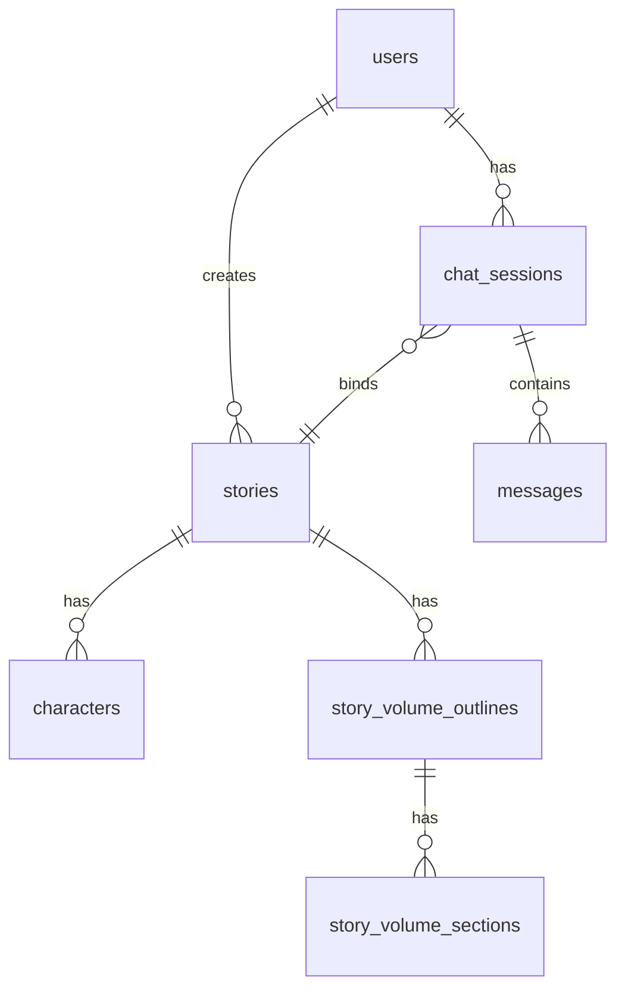

# AI漫剧生成对话系统

基于自然对话的AI漫剧创作平台，通过多轮对话收集用户需求，自动生成完整的漫画剧本、分镜和角色设定。

## 项目概述

这是一个全栈的AI漫剧生成系统，用户可以通过自然对话的形式与AI创作助手交互，逐步完善漫剧设定，最终生成包含角色、剧情、分镜、对白等完整内容的漫画剧本。

**核心特性：**
- **自然对话交互**：通过日常聊天形式收集创作需求，AI Agent 自动理解意图并调用对应能力
- **渐进式生成**：多轮对话逐步细化角色、剧情、风格设定
- **完整漫剧内容**：自动生成剧情大纲、分卷大纲、小节故事
- **异步任务架构**：RabbitMQ 消息队列驱动非对话 AI 任务，支持逐卷/逐节增量回传
- **模块化架构**：前后端分离，AI 引擎独立部署，易于扩展和维护
- **响应式界面**：适配PC、平板、手机多端

## 系统架构

### 技术栈

| 层级 | 技术选型 |
|------|----------|
| **前端** | Vue 3 + TypeScript + Pinia + Vue Router + Axios + Element Plus |
| **后端** | Java 17 + Spring Boot 3.2 + MyBatis-Plus + Spring Security |
| **AI引擎** | Python + LangChain + FastAPI + Pydantic + 通义千问 (qwen-max) |
| **数据库** | MySQL 8.0 + Redis 7 |
| **消息队列** | RabbitMQ 3.12+ |
| **文件存储** | 本地文件系统 (`./storage/`) |
| **API文档** | Knife4j (Spring Boot集成) |

### 架构图

```
┌─────────────┐    HTTP/WebSocket    ┌─────────────────┐    RabbitMQ     ┌─────────────────┐
│   Vue 前端   │ ────────────────────► │ Spring Boot 后端 │ ──────────────► │  Python AI 引擎  │
│  :8080      │ ◄──────────────────── │  :8085          │ ◄────────────── │  :5000          │
└─────────────┘    轮询结果           └────────┬────────┘    结果回传     └─────────────────┘
                                              │
                              ┌───────────────┼───────────────┐
                              │               │               │
                      ┌───────▼───────┐ ┌─────▼───────┐ ┌─────▼───────┐
                      │    MySQL     │ │    Redis    │ │   RabbitMQ  │
                      │  :3306      │ │  :6379     │ │  :5672     │
                      └──────────────┘ └────────────┘ └────────────┘
```

**调用链路：**
- **对话消息**：前端 → Java 后端 → Python Agent (HTTP) → Java 白名单分发 → 数据库
- **故事生成**：前端 → Java 后端 → RabbitMQ → Python Worker → RabbitMQ → Java 监听落库 → 前端轮询

## 快速开始

### 前置要求
- **Java 17+** (`java -version`)
- **Node.js 18+** (`node -v`)
- **Python 3.11+** (`python --version`)
- **Maven 3.9+** (`mvn -version`)
- **MySQL 8.0** (已安装并运行)
- **Redis 7** (已安装并运行)
- **RabbitMQ 3.12+** (已安装并运行)

### 环境配置

1. **克隆项目**
```bash
git clone <repository-url>
cd aisay
```

2. **数据库初始化**
```sql
mysql -u root -p < backend/src/main/resources/db/init.sql
```

3. **配置检查**
确保 `backend/src/main/resources/application.yml` 中的数据库连接信息与本地环境一致。

4. **Python AI 配置**
在 `python-ai/` 目录下创建 `api.yml`，填入通义千问 API Key：
```yaml
tongyi:
  api_key: "your-api-key-here"
```

### 启动服务

**窗口1：启动 Spring Boot 后端**
```bash
cd backend
mvn -gs ../settings.phase1.xml spring-boot:run
```

**窗口2：启动 Vue 前端**
```bash
cd frontend
npm install
npm run dev
```

**窗口3：启动 Python AI 引擎**
```bash
cd python-ai
pip install -r requirements.txt
python main.py
```

### 访问应用
- **前端界面**: http://localhost:8080
- **后端API文档**: http://localhost:8085/doc.html
- **RabbitMQ管理界面**: http://localhost:15672 (guest/guest)

## 项目结构

```
aisay/
├── backend/                        # Spring Boot 后端
│   └── src/main/java/com/aisay/manga/
│       ├── controller/             # REST API 控制器
│       ├── service/                # 业务逻辑层
│       ├── service/impl/           # 业务实现
│       ├── repository/             # MyBatis-Plus Mapper
│       ├── entity/                 # 数据库实体
│       ├── dto/
│       │   ├── request/            # 请求 DTO
│       │   ├── response/           # 响应 DTO
│       │   └── ai/                 # Java ↔ Python AI DTO
│       ├── config/                 # 配置类 (Security, RabbitMQ, Redis, etc.)
│       └── utils/                  # 工具类 (JWT, 文件存储, AI 任务发布)
│
├── frontend/                       # Vue 3 前端
│   └── src/
│       ├── views/                  # 页面组件 (Chat, StoryList, StoryDetail, User)
│       ├── components/             # 可复用组件
│       │   ├── chat/               # 聊天组件 (MessageBubble, InputArea, SessionList)
│       │   └── story/              # 漫剧组件 (CharacterCard)
│       ├── stores/                 # Pinia 状态管理
│       ├── api/                    # API 接口封装
│       ├── router/                 # Vue Router 路由配置
│       └── types/                  # TypeScript 类型定义
│
├── python-ai/                      # Python AI 引擎
│   ├── main.py                     # FastAPI 入口，挂载 router
│   ├── ai_runtime.py               # 通用运行时 (LLM 实例, 回调, 日志)
│   ├── story_ai.py                 # 故事相关 API (大纲/分卷/小节生成与修改)
│   ├── chat_ai.py                  # 对话 Agent API (意图理解与路由分发)
│   ├── prompt.py                   # 所有提示词模板
│   ├── rabbitmq_worker.py          # RabbitMQ 消费者，异步处理故事 AI 任务
│   ├── requirements.txt            # Python 依赖
│   └── api.yml                     # 通义千问 API Key (已 gitignore)
│
└── config.txt                      # 基础设施连接配置
```

## 核心功能

### 1. 用户认证
- JWT 无状态认证，token 有效期 24 小时
- 注册、登录、用户资料管理
- 头像上传（本地文件存储）

### 2. 对话系统
- 多轮对话会话管理
- AI Agent 自动理解用户意图，路由到对应 Java 方法
- 对话绑定漫剧，围绕一部作品持续迭代
- WebSocket 实时消息推送

### 3. 剧情大纲生成
- 用户输入题材和可选剧情，AI 自动生成完整剧情大纲
- 大纲包含：故事摘要、主线剧情、主要角色设定
- 支持大纲修改：用户输入修改意见，AI 自动重写

### 4. 分卷大纲生成
- 两阶段生成：先判断总分卷数，再逐卷生成详细大纲
- 每卷包含：卷名、摘要、详细剧情、卷末悬念
- 逐卷增量回传，前端可逐步查看已生成的分卷
- 支持自动修改（AI 重写）和手动修改（直接编辑）

### 5. 分卷小节故事生成
- 将单卷大纲拆解为 4-12 个小节
- 逐节生成具体故事细节，包含场景、动作、对话、冲突
- 增量回传，前端逐步展示已生成的小节

### 6. 异步任务架构
- RabbitMQ 消息队列驱动所有非对话 AI 任务
- Java 提交任务后立即返回，Python 后台异步处理
- 支持 partial/completed 消息，实现增量结果回传
- 前端轮询获取最新结果

## 数据库设计

系统使用 MySQL 存储核心业务数据：

### 实体关系图


### 核心表结构
- **users**: 用户账户信息
- **chat_sessions**: 聊天会话（绑定 story_id）
- **messages**: 会话内的用户与 AI 消息
- **stories**: 漫剧主记录（标题、摘要、大纲、状态）
- **characters**: 主要角色设定
- **story_volume_outlines**: 分卷大纲（一 story 多卷）
- **story_volume_sections**: 分卷小节故事（一卷多节）

### 故事状态流转
```
draft → generating → draft (大纲生成完成)
draft → revising → draft (大纲修改完成)
draft → volume_pending → draft (分卷生成完成)
draft → volume_section_pending → draft (小节生成完成)
任意状态 → failed (任务失败)
```

## API 接口

### 认证相关
- `POST /api/auth/register` - 用户注册
- `POST /api/auth/login` - 用户登录
- `GET /api/user/profile` - 获取用户信息
- `PUT /api/user/profile` - 更新用户信息

### 聊天服务
- `POST /api/chat/start` - 开始新对话（需绑定 storyId）
- `POST /api/chat/message` - 发送消息（Agent 路由分发）
- `GET /api/chat/history/{sessionId}` - 获取历史消息
- `GET /api/chat/sessions` - 获取用户会话列表
- `DELETE /api/chat/session/{sessionId}` - 删除会话

### 漫剧服务
- `POST /api/story/generate` - 生成剧情大纲（异步）
- `POST /api/story/{id}/outline/revise` - 修改剧情大纲（异步）
- `PUT /api/story/{id}/detail` - 手动保存大纲和角色
- `POST /api/story/{id}/volume-outline/generate` - 生成分卷大纲（异步）
- `POST /api/story/{id}/volume-outline/revise` - 自动修改分卷大纲（异步）
- `PUT /api/story/{id}/volume-outline` - 手动修改分卷大纲
- `POST /api/story/{id}/volume-outline/{volumeId}/sections/generate` - 生成小节故事（异步）
- `GET /api/story/{id}` - 获取漫剧详情
- `GET /api/story/list` - 获取漫剧列表
- `PUT /api/story/{id}` - 更新漫剧
- `DELETE /api/story/{id}` - 删除漫剧

### 文件服务
- `POST /api/files/upload` - 文件上传
- `GET /api/files/{category}/{date}/{filename}` - 文件下载

详细API文档启动后访问：http://localhost:8085/doc.html

## 开发指南

### 后端开发
```bash
cd backend
mvn -gs ../settings.phase1.xml compile      # 编译
mvn -gs ../settings.phase1.xml test         # 测试
mvn -gs ../settings.phase1.xml spring-boot:run  # 启动
```

### 前端开发
```bash
cd frontend
npm install      # 安装依赖
npm run dev      # 开发模式
npm run build    # 生产构建
```

### Python AI 引擎开发
```bash
cd python-ai
pip install -r requirements.txt   # 安装依赖
python main.py                    # 启动 FastAPI + RabbitMQ Worker
```

## 故障排除

### 常见问题

1. **后端编译失败**
   - 检查 Java 版本是否为 17+
   - 使用项目内 settings：`mvn -gs ../settings.phase1.xml compile`

2. **数据库连接失败**
   - 确认 MySQL 服务已启动
   - 检查 `application.yml` 中的连接信息
   - 确认已执行 `init.sql` 初始化数据库

3. **前端无法启动**
   - 检查 Node.js 版本：`node -v` >= 18.0.0
   - 清理重新安装：`rm -rf node_modules && npm install`

4. **Python AI 引擎报错**
   - 确认 `python-ai/api.yml` 中的 API Key 正确
   - 确认 RabbitMQ 服务已启动
   - 查看控制台 `[rabbitmq-worker]` 日志排查任务失败原因

5. **故事状态变为 failed**
   - 查看 Python 控制台日志中的错误信息
   - 确认通义千问 API Key 有效且有余额
   - 确认 RabbitMQ 连接正常

## 项目进度

详细开发进度见：[progress.md](./progress.md)

架构说明见：[architecture.md](./architecture.md)

## 许可证

本项目采用 MIT 许可证。
