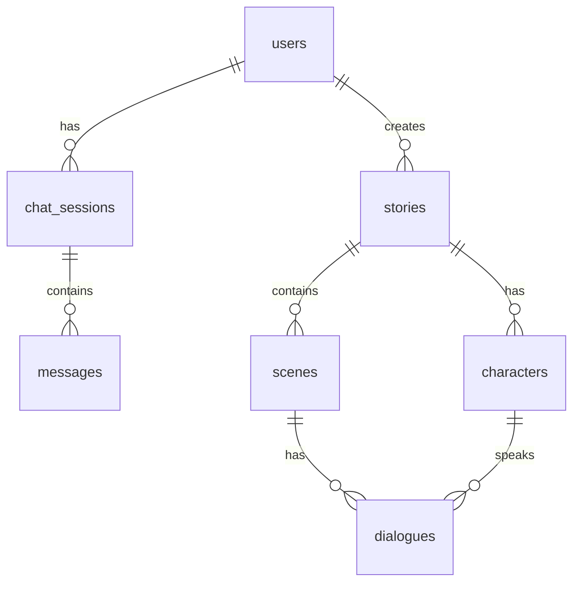

# AI漫剧生成对话系统

基于自然对话的AI漫剧创作平台，通过多轮对话收集用户需求，自动生成完整的漫画剧本、分镜和角色设定。

## 📋 项目概述

这是一个全栈的AI漫剧生成系统，用户可以通过自然对话的形式与AI创作助手交互，逐步完善漫剧设定，最终生成包含角色、剧情、分镜、对白等完整内容的漫画剧本。

**核心特性：**
- 💬 **自然对话交互**：通过日常聊天形式收集创作需求
- 🎨 **渐进式生成**：多轮对话逐步细化角色、剧情、风格设定
- 🖼️ **完整漫剧内容**：自动生成剧本大纲、分镜脚本、角色设定
- 🏗️ **模块化架构**：前后端分离，易于扩展和维护
- 📱 **响应式界面**：适配PC、平板、手机多端
- 💾 **本地化部署**：所有数据存储在本地，无需云端依赖

## 🏗️ 系统架构

### 技术栈
| 层级 | 技术选型 |
|------|----------|
| **前端** | Vue 3 + TypeScript + Pinia + Vue Router + Axios + Element Plus |
| **后端** | Java 17 + Spring Boot 3.2 + MyBatis-Plus + Spring Security |
| **AI引擎** | Python + LangChain + FastAPI + Pydantic |
| **数据库** | MySQL 8.0 + Redis 7 |
| **消息队列** | RabbitMQ 3.12+ |
| **文件存储** | 本地文件系统 (`./storage/`) |
| **API文档** | Knife4j (Spring Boot集成) |

### 架构图
```
┌─────────────┐    HTTP/WebSocket    ┌─────────────────┐
│   Vue前端   │ ────────────────────► │ Spring Boot后端 │
│  localhost:8080 │                    │  localhost:8085  │
└─────────────┘                    └─────────┬───────┘
                                             │
                ┌────────────────────────────┼────────────────────────────┐
                │                            │                            │
        ┌───────▼───────┐            ┌───────▼───────┐            ┌───────▼───────┐
        │    MySQL     │            │    Redis      │            │    RabbitMQ   │
        │  localhost:3306│            │  localhost:6379 │            │  localhost:5672 │
        └───────────────┘            └───────────────┘            └───────────────┘
```

## 🚀 快速开始

### 前置要求
- **Java 17+** (`java -version`)
- **Node.js 18+** (`node -v`)
- **Python 3.11+** (`python --version`)
- **Maven 3.9+** (`mvn -version`)
- **MySQL 8.0** (已安装并运行)
- **Redis 7** (已安装并运行)
- **RabbitMQ 3.12+** (已安装并运行)

### 环境配置

1. **克隆项目**
```bash
git clone <repository-url>
cd aisay
```

2. **数据库初始化**
```sql
-- 执行初始化脚本
mysql -u root -p < backend/src/main/resources/db/init.sql
```

3. **配置检查**
确保 `backend/src/main/resources/application.yml` 中的数据库连接信息与本地环境一致。

### 启动服务

#### 方式一：分窗口启动（推荐）

**窗口1：启动Spring Boot后端**
```bash
cd backend
mvn -gs ../settings.phase1.xml spring-boot:run
```

**窗口2：启动Vue前端**
```bash
cd frontend
npm install
npm run dev
```

**窗口3：启动Python AI引擎（可选，当前模拟回复）**
```bash
cd ai_engine
pip install -r requirements.txt
uvicorn main:app --host 0.0.0.0 --port 5000 --reload
```

#### 方式二：使用启动脚本
项目根目录提供启动脚本：
```bash
# Windows
./start-all.bat

# Linux/Mac
./start-all.sh
```

### 访问应用
- **前端界面**: http://localhost:8080
- **后端API文档**: http://localhost:8085/doc.html
- **MySQL**: localhost:3306
- **Redis**: localhost:6379
- **RabbitMQ管理界面**: http://localhost:15672 (guest/guest)

## 📁 项目结构

```
aisay/
├── backend/                    # Spring Boot后端
│   ├── src/
│   │   ├── main/
│   │   │   ├── java/com/aisay/manga/
│   │   │   │   ├── controller/     # REST API控制器
│   │   │   │   ├── service/        # 业务逻辑层
│   │   │   │   ├── service/impl/   # 业务实现
│   │   │   │   ├── repository/     # 数据访问层
│   │   │   │   ├── entity/         # 数据库实体
│   │   │   │   ├── dto/request/    # 请求DTO
│   │   │   │   ├── dto/response/   # 响应DTO
│   │   │   │   ├── config/         # 配置类
│   │   │   │   └── utils/          # 工具类
│   │   │   └── resources/
│   │   │       ├── application.yml # 主配置文件
│   │   │       └── db/init.sql     # 数据库初始化脚本
│   │   └── test/                   # 单元测试
│   ├── mvn_repo/                   # 本地Maven仓库
│   └── pom.xml                     # Maven依赖配置
├── frontend/                   # Vue前端
│   ├── src/
│   │   ├── views/              # 页面级组件
│   │   ├── components/         # 可复用组件
│   │   │   ├── chat/           # 聊天相关组件
│   │   │   ├── story/          # 漫剧相关组件
│   │   │   └── common/         # 通用组件
│   │   ├── stores/             # Pinia状态管理
│   │   ├── api/                # API接口封装
│   │   ├── router/             # Vue路由配置
│   │   ├── types/              # TypeScript类型定义
│   │   └── styles/             # 样式文件
│   ├── vite.config.ts          # Vite配置
│   └── package.json            # npm依赖配置
├── storage/                    # 本地文件存储
│   ├── uploads/                # 用户上传文件
│   ├── stories/                # 漫剧资源
│   ├── temp/                   # 临时文件
│   ├── backups/                # 备份文件
│   └── logs/                   # 日志文件
├── ai_engine/                  # Python AI引擎（后续实现）
├── docs/                       # 项目文档
├── scripts/                    # 部署和运维脚本
└── config.txt                  # 基础设施连接配置
```

## 📊 数据库设计

系统使用MySQL存储核心业务数据，包含7张核心表：

### 实体关系图


### 核心表结构
- **users**: 用户账户信息
- **chat_sessions**: 聊天会话元数据
- **messages**: 会话内的用户与AI消息
- **stories**: 漫剧主记录
- **characters**: 角色设定
- **scenes**: 场景/分镜描述
- **dialogues**: 场景对白

## 🔧 开发指南

### 后端开发
1. **环境配置**
```bash
cd backend
# 使用项目内settings避免写入全局Maven仓库
mvn -gs ../settings.phase1.xml compile
```

2. **运行测试**
```bash
# 编译
mvn -gs ../settings.phase1.xml compile

# 运行测试
mvn -gs ../settings.phase1.xml test

# 启动应用
mvn -gs ../settings.phase1.xml spring-boot:run
```

3. **代码规范**
- 使用Lombok简化POJO
- 遵循Spring Boot分层架构
- 统一使用MyBatis-Plus进行数据访问
- DTO分离API契约与内部模型

### 前端开发
1. **环境配置**
```bash
cd frontend
npm install
```

2. **开发模式**
```bash
npm run dev
# 访问 http://localhost:8080
```

3. **构建生产版本**
```bash
npm run build
```

4. **代码规范**
- 使用TypeScript确保类型安全
- 组件化开发，遵循Vue 3 Composition API
- 状态管理使用Pinia
- 样式使用Sass/SCSS

### 数据库操作
1. **初始化数据库**
```sql
-- 创建数据库和用户
mysql -u root -p < backend/src/main/resources/db/init.sql
```

2. **验证表结构**
```sql
-- 连接数据库
mysql -u aisay -p aisay_pass springcloud

-- 查看所有表
SHOW TABLES;
```

## 📝 API接口

### 认证相关
- `POST /api/auth/register` - 用户注册
- `POST /api/auth/login` - 用户登录
- `GET /api/user/profile` - 获取用户信息
- `PUT /api/user/profile` - 更新用户信息

### 聊天服务
- `POST /api/chat/start` - 开始新对话
- `POST /api/chat/message` - 发送消息
- `GET /api/chat/history/{sessionId}` - 获取历史消息
- `GET /api/chat/sessions` - 获取用户会话列表
- `DELETE /api/chat/session/{sessionId}` - 删除会话

### 漫剧服务
- `POST /api/story/generate` - 生成漫剧
- `GET /api/story/{id}` - 获取漫剧详情
- `GET /api/story/list` - 获取漫剧列表
- `PUT /api/story/{id}` - 更新漫剧
- `DELETE /api/story/{id}` - 删除漫剧

### 文件服务
- `POST /api/files/upload` - 文件上传
- `GET /api/files/{category}/{date}/{filename}` - 文件下载
- `DELETE /api/files/{category}/{date}/{filename}` - 文件删除

详细API文档启动后访问：http://localhost:8085/doc.html

## 🧪 测试

### 后端测试
```bash
cd backend
# 运行所有测试
mvn -gs ../settings.phase1.xml test

# 运行特定测试类
mvn -gs ../settings.phase1.xml test -Dtest=UserMapperTest

# 启用MySQL集成测试（需先初始化数据库）
mvn -gs ../settings.phase1.xml test -Daisay.integration.mysql=true
```

### 前端测试
```bash
cd frontend
# 运行单元测试
npm run test:unit

# 运行端到端测试
npm run test:e2e
```

## 🔐 安全配置

### JWT认证
- 用户登录后颁发JWT令牌
- 令牌有效期24小时
- 所有受保护API需携带 `Authorization: Bearer <token>` 头部

### 数据安全
- 密码使用BCrypt加密存储
- 文件上传限制10MB，白名单文件类型
- 防止SQL注入、XSS攻击
- 跨域请求限制（开发环境允许localhost:8080）

### API限流
- 基于用户/IP的请求频率限制
- 保护AI引擎资源，防止滥用

## 📈 部署与运维

### 本地部署检查清单
- [ ] MySQL 8.0已安装并运行
- [ ] Redis 7已安装并运行
- [ ] RabbitMQ 3.12+已安装并运行
- [ ] 数据库已初始化（执行init.sql）
- [ ] Java 17+已安装
- [ ] Node.js 18+已安装
- [ ] Python 3.11+已安装（如需运行AI引擎）
- [ ] 磁盘空间充足（至少5GB）

### 文件存储管理
- 根目录：`./storage/`
- 定期清理临时文件：`./storage/temp/`
- 定期备份：`./storage/backups/`
- 日志轮转：`./storage/logs/`

### 性能监控
- **应用监控**: Spring Boot Actuator
- **日志监控**: 本地日志文件 `./storage/logs/`
- **数据库监控**: 慢查询日志
- **文件系统监控**: 磁盘空间使用情况

## 📋 项目进度

### 已完成阶段
✅ **Phase 1**: 项目脚手架与基础设施
  - Spring Boot后端项目初始化
  - Vue 3前端项目初始化
  - 基础配置和目录结构

✅ **Phase 2**: 数据库初始化
  - MySQL数据库表结构设计
  - MyBatis-Plus和Redis配置
  - 数据库初始化脚本

✅ **Phase 3**: 后端实体与数据访问层
  - 7个核心实体类
  - MyBatis-Plus Mapper接口
  - 数据访问层基础测试

✅ **Phase 4**: 后端DTO层
  - 请求/响应DTO定义
  - 数据校验配置
  - 统一响应格式

### 后续计划
- **Phase 5**: 安全与认证模块
- **Phase 6**: 聊天服务核心功能
- **Phase 7**: 漫剧服务模块
- **Phase 8**: 文件存储与异常处理
- **Phase 9-14**: 前端功能模块

详细实现计划见：[Implementation-plan.md](./Implementation-plan.md)

## 🐛 故障排除

### 常见问题

1. **Maven编译失败**
   - 检查Java版本是否为17+
   - 使用项目内settings文件：`mvn -gs ../settings.phase1.xml compile`
   - 清理并重新构建：`mvn clean compile`

2. **数据库连接失败**
   - 确认MySQL服务已启动：`net start MySQL80`
   - 检查`application.yml`中的连接信息
   - 验证用户权限：`aisay`用户是否对数据库有权限

3. **前端无法启动**
   - 检查Node.js版本：`node -v` >= 18.0.0
   - 清理node_modules重新安装：`rm -rf node_modules && npm install`
   - 检查端口占用：8080端口是否被其他应用占用

4. **Redis连接失败**
   - 确认Redis服务已启动：`redis-cli ping`
   - 检查Redis配置：`application.yml`中的host和port

### 日志查看
```bash
# 后端日志（控制台输出）
cd backend && tail -f backend.log

# 前端日志（浏览器控制台）
# 访问 http://localhost:8080 按F12打开开发者工具

# 数据库日志
# 查看MySQL错误日志位置
```

## 📄 相关文档

- [设计文档](./design-document.md) - 系统详细设计说明
- [技术栈文档](./tech-stack.md) - 技术选型与版本要求
- [架构文档](./architecture.md) - 模块架构说明
- [实现计划](./Implementation-plan.md) - 开发路线图与任务分解
- [进度记录](./progress.md) - 项目开发进度跟踪

## 👥 贡献指南

1. **分支管理**
   - `main` - 主分支，稳定版本
   - `develop` - 开发分支
   - `feature/*` - 功能分支
   - `bugfix/*` - bug修复分支

2. **代码提交**
   - 遵循Conventional Commits规范
   - 提交前运行代码检查和测试
   - 编写清晰的提交信息

3. **Pull Request流程**
   - 从`develop`分支创建功能分支
   - 完成开发并确保测试通过
   - 创建PR请求合并到`develop`
   - 代码审查通过后合并

## 📄 许可证

本项目采用 MIT 许可证 - 查看 [LICENSE](LICENSE) 文件了解详情。

## 📞 支持与反馈

如有问题或建议，请：
1. 查看[故障排除](#故障排除)章节
2. 检查相关文档
3. 提交Issue到项目仓库
4. 通过邮件联系项目维护者

---

**最后更新**: 2026-05-16  
**版本**: v0.1.0  
**状态**: 开发中 (Phase 4已完成)  
**维护者**: AI漫剧生成系统项目组