# AI漫剧生成系统模块架构说明

## 当前阶段架构范围

Phase 1 已完成前后端工程骨架搭建，当前架构重点是建立清晰的模块边界、运行入口和基础设施连接配置。AI 引擎、数据库表结构、实体、认证、聊天和漫剧业务逻辑会在后续阶段逐步落入这些模块。

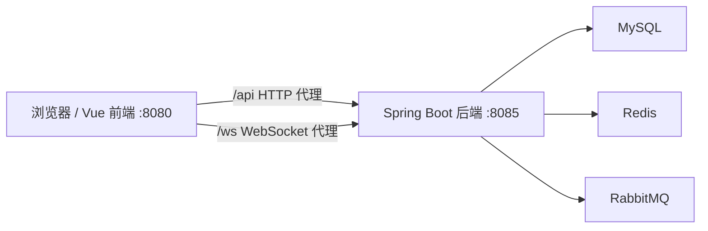

## 后端模块

后端工程位于 `F:\ai\aisay\backend`，主包为 `com.aisay.manga`。当前采用标准 Spring Boot 分层结构，为后续功能留下稳定落点。

- `controller`：REST API 与 WebSocket 控制器入口，后续承载用户、聊天、漫剧、文件等接口。
- `service`：业务接口层，定义用户、聊天、漫剧生成等业务能力。
- `service.impl`：业务实现层，封装流程编排、权限校验、事务处理和模拟 AI 回复逻辑。
- `repository`：数据访问层，后续放置 MyBatis-Plus Mapper。
- `entity`：数据库实体层，对应 users、chat_sessions、messages、stories 等核心表。
- `dto.request`：请求 DTO，隔离外部 API 入参与内部实体。
- `dto.response`：响应 DTO，统一对前端返回的数据结构。
- `config`：Spring Security、MyBatis-Plus、Redis、WebSocket、CORS、Knife4j 等配置类。
- `utils`：JWT、本地文件存储、通用转换等工具类。

后端配置集中在 `backend/src/main/resources/application.yml`。阶段一已经接入 `config.txt` 中的 MySQL、Redis 和 RabbitMQ 地址与账号信息，并设置服务端口为 `8085`。

## 前端模块

前端工程位于 `F:\ai\aisay\frontend`，采用 Vue 3、TypeScript、Vite、Pinia、Vue Router 和 Element Plus。当前入口和目录结构已就绪，页面与业务状态会在后续阶段增量实现。

- `views`：页面级组件，如聊天页、登录页、注册页、漫剧列表、漫剧详情、用户中心。
- `components/chat`：聊天域组件，如消息气泡、输入框、会话列表。
- `components/story`：漫剧域组件，如角色卡片、分镜/故事展示组件。
- `components/common`：跨模块通用组件，如布局、加载态、错误展示。
- `stores`：Pinia 状态管理，后续拆分用户、聊天、漫剧 store。
- `api`：Axios API 封装，后续按认证、聊天、漫剧等领域拆分。
- `router`：Vue Router 配置，阶段一保持空路由表，后续按实现计划逐步加入页面路由和鉴权守卫。
- `types`：前端共享 TypeScript 类型定义。
- `styles`：全局样式、变量和主题入口。

`frontend/vite.config.ts` 已配置开发端口 `8080`，并将 `/api` 与 `/ws` 分别代理到后端 REST 与 WebSocket 服务，保证前端开发阶段不需要硬编码后端地址。

## 基础设施连接

当前配置遵循用户提供的 `config.txt`，不是设计文档中的示例账号。

- MySQL：`jdbc:mysql://localhost:3306/springcloud?...`，用户名 `root`，密码 `root`。
- Redis：`127.0.0.1:6379`，database `0`。
- RabbitMQ：`127.0.0.1:5672`，用户名 `guest`，密码 `guest`。

Phase 2 已选择与 `config.txt` 保持一致，初始化 SQL 默认面向 `springcloud`。如果后续需要切回设计文档中的 `aisay_manga`，需要同步调整 `init.sql` 和 `application.yml`。

## 数据库初始化模块

Phase 2 新增 `backend/src/main/resources/db/init.sql` 作为数据库结构的唯一初始化入口。该文件默认面向当前配置中的 `springcloud` 数据库，包含建库、业务用户授权和 7 张核心业务表。

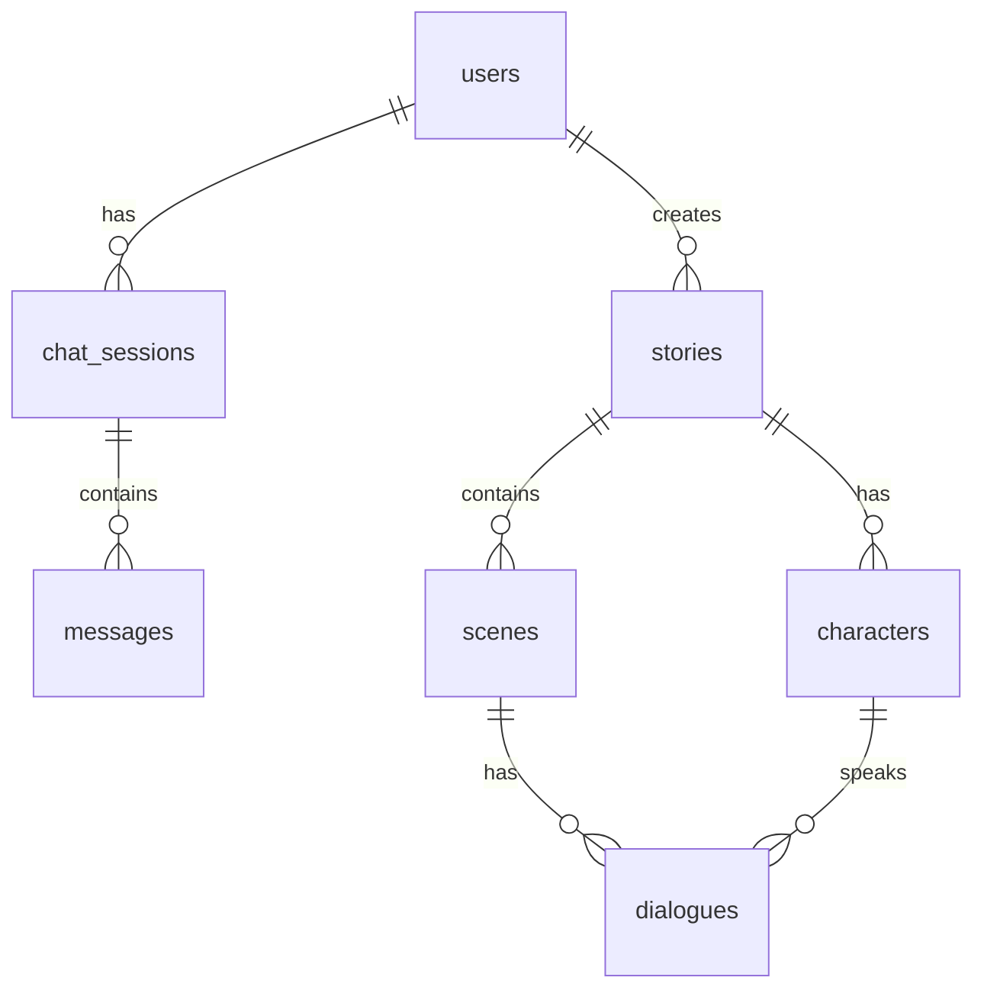

表职责如下：

- `users`：保存注册用户、邮箱、密码哈希、头像和偏好配置。
- `chat_sessions`：保存用户与 AI 创作助手的会话元数据、当前阶段和进度。
- `messages`：保存会话内用户消息与 AI 消息。
- `stories`：保存漫剧主记录，包括标题、类型、风格、摘要、全文、封面和统计数据。
- `characters`：保存某部漫剧下的角色设定。
- `scenes`：保存某部漫剧下的场景/分镜描述。
- `dialogues`：保存场景中的对白，并可关联到具体角色。

## MyBatis-Plus 配置模块

Phase 2 新增 `com.aisay.manga.config.MyBatisPlusConfig`。该配置类负责注册 MyBatis-Plus 拦截器链，目前包含分页插件和乐观锁插件。

- 分页插件面向 MySQL，用于后续漫剧列表、会话列表等分页查询。
- 乐观锁插件为后续需要版本控制的实体预留能力，避免并发更新覆盖。
- `application.yml` 中集中配置 XML Mapper 扫描路径、实体别名包、下划线转驼峰和全局逻辑删除值。

## Redis 配置模块

Phase 2 新增 `com.aisay.manga.config.RedisConfig`。该配置提供统一的 `RedisTemplate<String, Object>`，避免各业务模块自行配置序列化策略。

- Redis key 和 hash key 使用 `StringRedisSerializer`，保证可读性和跨工具兼容性。
- Redis value 和 hash value 使用 `GenericJackson2JsonRedisSerializer`，便于保存后续会话上下文、缓存对象和任务状态。
- 该配置为后续聊天上下文缓存、用户资料缓存和生成任务状态缓存提供基础设施。

## 实体与数据访问模块

Phase 3 在后端补齐了实体层和 Mapper 层，形成从数据库表到 Java 对象再到数据访问接口的基础通路。

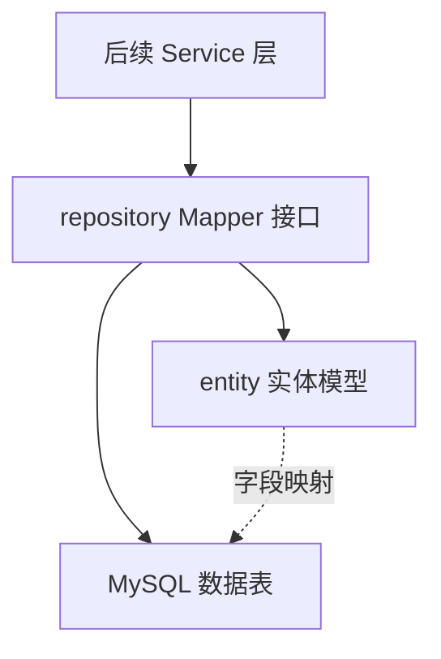

实体层说明：

- `User` 对应 `users`，承载用户账号、邮箱、密码哈希、头像和偏好配置。
- `ChatSession` 对应 `chat_sessions`，承载会话状态、进度、上下文 JSON 和最后活跃时间。
- `Message` 对应 `messages`，承载用户/AI 消息、元数据 JSON 和创建时间。
- `Story` 对应 `stories`，承载漫剧主信息、全文内容、封面和统计字段。
- `Character` 对应 `characters`，承载角色设定；由于 Java 内置 `Character` 已占用 MyBatis 类型别名，该实体显式使用 `MangaCharacter` 别名。
- `Scene` 对应 `scenes`，承载场景序号、场景设定、描述和视觉元素 JSON。
- `Dialogue` 对应 `dialogues`，承载场景对白；SQL 保留字 `order` 通过反引号列名映射。

Mapper 层说明：

- 所有 Mapper 统一放在 `com.aisay.manga.repository`，由主启动类 `@MapperScan` 扫描。
- 基础 CRUD 由 MyBatis-Plus `BaseMapper<T>` 提供，减少重复 SQL。
- `ChatSessionMapper` 提供按用户和状态查询会话，服务后续会话列表。
- `MessageMapper` 提供按会话时间顺序查询消息，服务后续聊天历史。
- `StoryMapper` 提供按用户分页查询漫剧，服务后续个人作品列表。

测试策略：

- `UserMapperTest` 是真实 MySQL 集成测试，但默认跳过。
- 跳过的原因是数据库初始化 SQL 由用户手动执行，自动测试不能假设表已存在。
- 用户执行 `init.sql` 并确认表存在后，可通过 `-Daisay.integration.mysql=true` 显式开启真实数据库验证。

## DTO 模块

Phase 4 新增 DTO 层，用于隔离外部 API 契约、内部业务模型和数据库实体。DTO 不直接访问数据库，也不承载业务流程，只负责请求参数校验和响应数据结构。

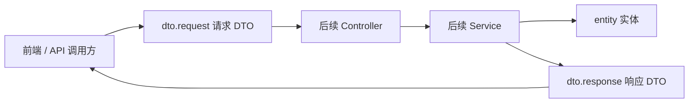

请求 DTO 说明：

- 认证相关：`RegisterRequest`、`LoginRequest`。
- 用户资料相关：`UserUpdateRequest`。
- 聊天相关：`ChatStartRequest`、`SendMessageRequest`。
- 漫剧相关：`StoryGenerateRequest`、`StoryUpdateRequest`。
- 基础格式校验使用 Jakarta Bean Validation，例如 `@NotBlank`、`@NotNull`、`@Email`、`@Size`。

响应 DTO 说明：

- `ApiResponse<T>` 是统一响应包装，后续 Controller 默认返回该结构。
- `LoginResponse` 承载登录令牌和用户基础信息。
- `UserProfileResponse` 承载用户中心展示所需信息。
- `ChatSessionResponse` 和 `MessageResponse` 承载聊天页面所需数据。
- `StoryResponse` 承载漫剧列表卡片所需数据。
- `StoryDetailResponse` 继承 `StoryResponse`，扩展全文和角色列表，服务漫剧详情页；场景列表字段保留兼容，但前端当前不展示。

边界约定：

- DTO 不暴露 `passwordHash`、`preferences` 等内部字段，避免敏感信息或内部结构泄露到前端。
- DTO 的基础校验只处理格式与必填；唯一性、归属关系、权限控制由后续 Service 和 Security 层承担。
- Entity 与 DTO 之间的转换将在后续 Service 层实现，必要时可增加专门的 converter/assembler。

## 安全认证模块

Phase 5 新增基于 JWT 的无状态认证体系。登录成功后后端签发 token，前端后续请求通过 `Authorization: Bearer <token>` 携带身份；后端过滤器验证 token 后把用户 ID 写入 Spring Security 上下文。

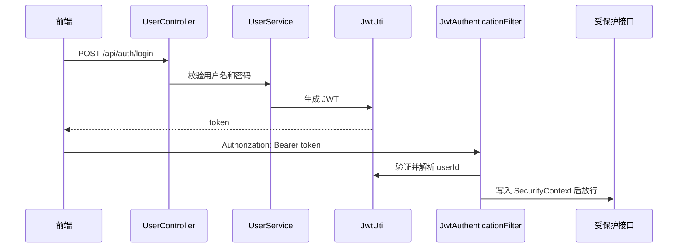

安全配置说明：

- `SecurityConfig` 关闭 CSRF、表单登录和 HTTP Basic，使用无状态会话。
- `/api/auth/**`、Knife4j/OpenAPI 文档资源和 `/ws/**` 放行。
- 其他接口默认需要认证。
- 未认证请求返回 JSON 格式的 `ApiResponse`，HTTP 状态码为 401。
- `CorsConfig` 允许前端开发地址 `localhost:8080` 和 `127.0.0.1:8080`。

认证业务说明：

- `JwtUtil` 负责 token 签发、验证和解析。
- `JwtAuthenticationFilter` 负责从请求头解析 Bearer token 并设置认证上下文。
- `SecurityUtils` 提供 `getCurrentUserId()`，后续业务接口用它获取当前登录用户。
- `UserServiceImpl` 负责注册、登录、获取和更新用户资料。
- 密码仅保存 BCrypt 哈希，不在响应 DTO 中返回。

接口边界：

- `POST /api/auth/register` 和 `POST /api/auth/login` 不需要 token。
- `GET /api/user/profile` 和 `PUT /api/user/profile` 需要有效 token。
- 当前异常响应将在 Phase 8 的全局异常处理阶段统一收口。

## 聊天服务模块

Phase 6 新增聊天会话、消息发送、固定 AI 回复和 WebSocket 推送能力。当前聊天服务仍是 MVP 模拟实现：后端保存用户消息后生成固定 AI 回复，不调用外部 AI 引擎。

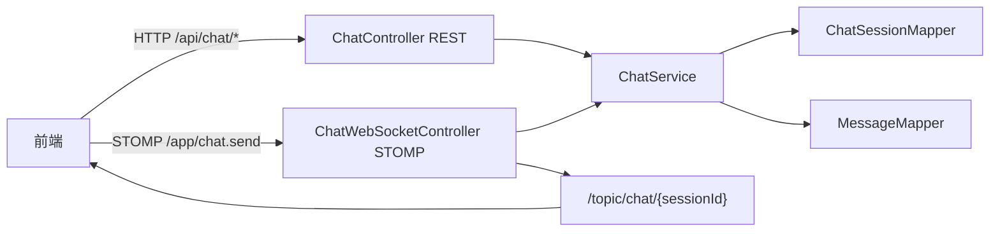

REST 接口：

- `POST /api/chat/start` 创建会话。
- `POST /api/chat/message` 发送用户消息并返回 AI 固定回复。
- `GET /api/chat/history/{sessionId}` 查询会话历史。
- `GET /api/chat/sessions` 查询当前用户会话列表。
- `DELETE /api/chat/session/{sessionId}` 将会话标记为 `deleted`。

服务层规则：

- 所有聊天操作都基于当前登录用户 ID。
- 读取、发送、删除会话前都会校验会话归属。
- 删除会话采用状态标记，不物理删除消息，便于后续审计或恢复策略扩展。
- 会话创建时默认阶段为 `INITIAL`，进度为 `0`。
- 消息角色使用 `user` 和 `ai`。

WebSocket 规则：

- STOMP 端点为 `/ws/chat`，SockJS 可用。
- 应用消息前缀为 `/app`，当前发送目的地为 `/app/chat.send`。
- 订阅目的地为 `/topic/chat/{sessionId}`。
- 握手路径放行，但发送消息时需要在 STOMP native header 中携带 `Authorization: Bearer <token>`。
- WebSocket 和 HTTP 共用 `ChatService.sendMessage`，避免双写不同业务逻辑。

## 后续演进

Phase 7 到 Phase 8 会在后端现有包结构中继续补齐漫剧、文件与异常处理。Phase 9 之后会在前端现有目录中逐步实现路由、布局、认证、聊天、漫剧和用户中心页面。

## 漫剧服务模块

Phase 7 在后端补齐 `StoryService` 与 `StoryController`，让“对话收集需求 -> 生成漫剧草稿 -> 查看/编辑/删除作品”的主链路有了可调用的 REST API。当前实现仍是 MVP 模拟生成，不接入 Python/LangChain AI 引擎，也不投递 RabbitMQ 异步任务。

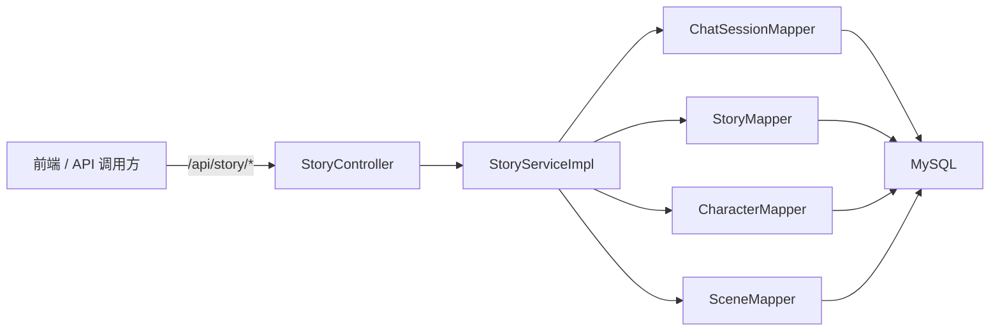

模块职责：

- `StoryController` 只负责接收 HTTP 请求、读取当前登录用户 ID、调用服务层并包装 `ApiResponse`。
- `StoryServiceImpl` 负责业务规则：会话归属校验、漫剧归属校验、模拟生成、分页查询、详情组装、字段更新和删除。
- `StoryMapper` 负责 `stories` 主表 CRUD 与当前用户漫剧分页查询。
- `CharacterMapper` 和 `SceneMapper` 负责加载或写入漫剧详情页所需的角色、场景数据。
- `ChatSessionMapper` 在生成漫剧前用于确认 `sessionId` 合法，保证用户只能基于自己的会话生成作品。

接口边界：

- `POST /api/story/generate` 需要登录，并要求请求体包含 `sessionId`；当前会创建 1 条 `stories`、2 条 `characters`、2 条 `scenes`。
- `GET /api/story/list?page=1&size=10` 返回当前用户的分页漫剧列表，排序规则为 `updated_at DESC, id DESC`。
- `GET /api/story/{id}` 返回当前用户拥有的漫剧详情，包括 `fullContent`、`characters`、`scenes`。
- `PUT /api/story/{id}` 只更新请求中非 `null` 字段，适合前端做局部编辑。
- `DELETE /api/story/{id}` 删除当前用户拥有的漫剧；关联角色、场景、对白依赖数据库外键级联清理。

数据流：

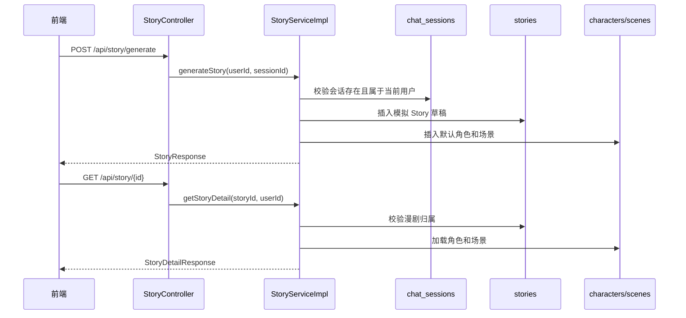

设计约束：

- 权限校验放在服务层，避免不同入口重复实现归属判断。
- DTO 不暴露数据库内部统计字段之外的敏感信息，详情页只返回前端当前阶段需要的故事、角色和场景。
- 当前生成内容是固定模拟数据，后续接入 AI 引擎时可以保持 Controller 契约不变，只替换 `StoryServiceImpl.generateStory` 内部编排逻辑。

## 文件存储与异常处理模块

Phase 8 新增本地文件存储和统一异常处理。文件服务把上传文件落到后端本地 `storage` 目录，返回相对路径和 API URL；异常处理把参数错误、越权、资源不存在、文件错误和兜底错误统一包装成 `ApiResponse`。

```mermaid
flowchart LR
    Client["前端 / API 调用方"]
    FileController["FileController"]
    StorageUtil["LocalFileStorageUtil"]
    Storage["backend/storage"]
    ExceptionHandler["GlobalExceptionHandler"]
    ErrorController["ApiErrorController"]

    Client -->|POST /api/files/upload| FileController
    Client -->|GET /api/files/{category}/{date}/{filename}| FileController
    Client -->|DELETE /api/files/{category}/{date}/{filename}| FileController
    FileController --> StorageUtil
    StorageUtil --> Storage
    FileController -.异常.-> ExceptionHandler
    Client -->|未知接口 /error| ErrorController
```

文件服务职责：

- `StorageConfig` 负责读取 `storage.root-path`、`storage.max-file-size`、`storage.max-request-size`，并创建 `LocalFileStorageUtil` Bean。
- `LocalFileStorageUtil` 负责文件保存、读取、删除、URL 生成和路径安全校验。
- `FileController` 负责 HTTP multipart 上传、资源读取和删除接口。
- `FileUploadResponse` 作为上传响应 DTO，承载 `originalFilename`、`filePath`、`fileUrl`、`size`、`contentType`。

文件路径规则：

- 根目录默认是后端工作目录下的 `./storage`。
- 保存路径为 `{category}/{yyyy-MM-dd}/{uuid.ext}`，例如 `resources/2026-05-17/xxxx.png`。
- 当前分类名只允许字母、数字、下划线和短横线，避免把用户输入直接变成任意目录。
- 当前扩展名白名单为 `jpg`、`jpeg`、`png`、`gif`、`bmp`、`pdf`、`epub`。
- 读取和删除文件前会做路径规范化，并确保最终路径仍在 `storage` 根目录内。

异常处理职责：

- `GlobalExceptionHandler` 处理 Controller 和 Service 抛出的业务异常、参数校验异常、multipart 异常、文件 IO 异常和未知异常。
- `ApiErrorController` 处理 Spring Boot 错误转发，保证未知接口也返回统一 JSON。
- `SecurityConfig` 放行 `/error`，避免错误转发被认证流程抢先变成 401。

统一响应约定：

- 参数校验失败返回 HTTP 400，响应体 `code=400`，字段级错误放在 `data` 中。
- 越权访问返回 HTTP 403，响应体 `code=403`。
- 资源不存在或接口不存在返回 HTTP 404，响应体 `code=404`。
- 未认证请求仍由 Spring Security entry point 返回 HTTP 401 JSON。
- 未预期异常返回 HTTP 500，避免把堆栈信息暴露给前端。

设计约束：

- 当前所有 `/api/files/**` 接口都沿用 JWT 认证规则；如果后续封面图需要公开展示，可以仅放行 `GET /api/files/**`，上传和删除继续要求认证。
- 当前文件元数据不单独入库，由业务字段保存返回的 `filePath` 或 `fileUrl`；例如用户头像可写入 `users.avatar_path`，漫剧封面可写入 `stories.cover_image_path`。
- 本地文件存储适合 MVP 和单机开发，后续如迁移到 MinIO/对象存储，可以保留 Controller 响应契约，只替换 `LocalFileStorageUtil` 的实现。

## 前端路由与基础布局模块

Phase 9 在前端补齐 Vue Router 路由表、登录守卫和应用主布局。当前阶段的页面以可编译占位内容为主，目的是先稳定页面骨架，让 Phase 10 到 Phase 13 可以在既有路由和布局中继续接入认证、聊天、漫剧和用户中心业务。

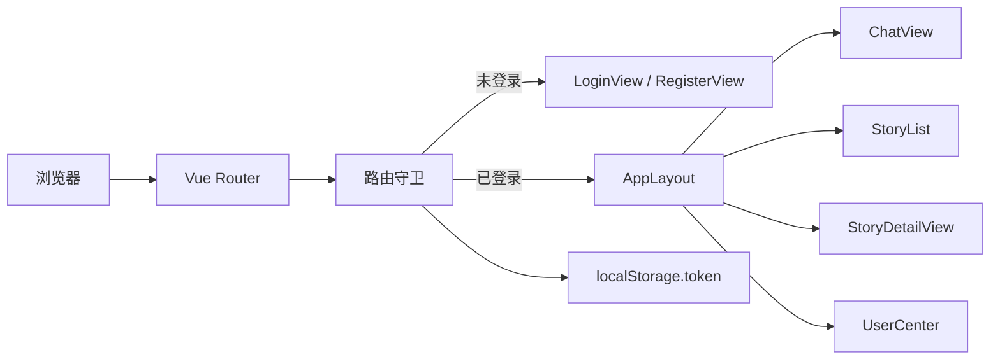

路由结构：

- `/` 会根据本地 token 是否有效重定向到 `/chat` 或 `/login`。
- `/login` 和 `/register` 是访客页面，不套用主布局。
- `/chat`、`/chat/:sessionId`、`/stories`、`/story/:id`、`/user` 是受保护页面，统一挂在 `AppLayout` 下。
- 未知前端路径兜底重定向到 `/chat`，再由守卫决定是否需要登录。
- 所有页面组件均使用懒加载，减少首屏路由表对后续模块的耦合。

守卫规则：

- 受保护路由依赖 `localStorage.token` 判断登录态，并会解析 JWT `exp` 清理过期登录态。
- 未登录访问受保护路由时跳转 `/login?redirect=<原路径>`。
- 已登录访问 `/login` 或 `/register` 时跳转 `/chat`。
- 当前路由守卫保持轻量，Pinia 用户 Store 负责登录、退出和用户资料持久化。

布局职责：

- `AppLayout` 提供顶部导航、品牌入口、用户菜单和内容承载区。
- 顶部导航当前包含 `对话` 与 `漫剧列表`，对应 `/chat` 和 `/stories`。
- 用户菜单当前包含 `个人中心` 和 `退出登录`。
- 退出登录负责清理 `localStorage.token` 与 `localStorage.userInfo`，并跳转 `/login`。
- 布局通过 `<RouterView />` 渲染子页面，保证后续业务页面只关注自身内容。

页面边界：

- `ChatView` 已接入会话列表、消息列表、输入区、WebSocket 订阅和生成漫剧入口。
- `StoryList` 已接入漫剧卡片网格、分页、当前页筛选和删除入口。
- `StoryDetailView` 已接入摘要、剧情大纲、主要角色卡片、编辑、删除和大纲修改入口。
- `UserCenter` 已接入资料展示、资料编辑、头像上传和创作统计。
- `LoginView` 和 `RegisterView` 已接入真实认证接口。

设计约束：

- 路由层只做最小登录态判断和过期 token 清理，业务数据加载仍放在各页面 Store 中。
- 登录 token 来自 `POST /api/auth/login` 返回的 JWT，并通过 Axios 拦截器注入后续 API 请求。
- 视觉层保留明确的品牌感和响应式布局，但不抢占后续聊天、漫剧列表、用户中心的业务组件设计空间。

## 前端认证模块

Phase 10 在前端补齐认证 API、Axios 拦截器、用户 Store，以及真实登录/注册表单。该模块把后端 Phase 5 的 JWT 认证接口接入前端路由体系，为后续聊天、漫剧和用户中心页面提供统一登录态。

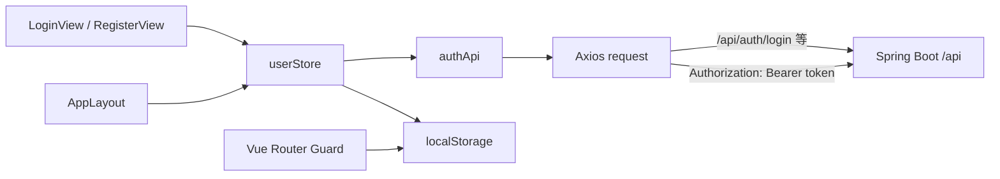

API 层职责：

- `api/index.ts` 创建统一 Axios 实例，`baseURL` 为空，由 Vite 代理把 `/api` 转发到后端 `8085`。
- 请求拦截器从 `localStorage.token` 读取 JWT，并注入 `Authorization: Bearer <token>`。
- 响应拦截器处理 401：清理本地登录态、跳转登录页、保留当前路径到 `redirect`。
- 响应拦截器处理非 401 错误：优先显示后端 `ApiResponse.message`。
- `api/authApi.ts` 封装注册、登录、获取资料、更新资料接口，页面和 Store 不直接写 URL。

用户状态职责：

- `stores/userStore.ts` 维护 `token`、`userInfo`、`isLoggedIn`。
- Store 初始化时从 `localStorage` 恢复登录态，保证刷新页面后仍可保留登录状态。
- `login` action 会调用后端登录接口获取 JWT，再调用 `getProfile` 获取完整用户资料。
- `register` action 调用注册接口但不自动登录，因为当前后端注册接口不返回 JWT。
- `logout` action 清理 Store 与 `localStorage`，供布局菜单和 401 拦截复用。

页面职责：

- `LoginView` 负责用户名/密码表单校验、调用 `userStore.login()`、登录成功后跳转 `redirect` 或 `/chat`。
- `RegisterView` 负责用户名/邮箱/密码/确认密码表单校验、调用 `userStore.register()`、注册成功后跳转 `/login`。
- `AppLayout` 从 `userStore.userInfo` 读取用户名，并通过 `userStore.logout()` 退出登录。

认证流：

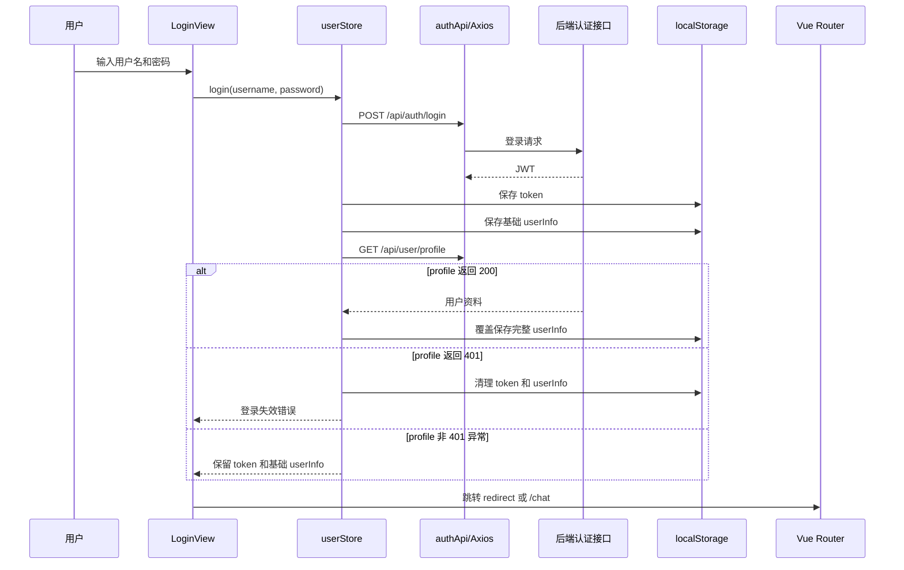

设计约束：

- 路由守卫当前仍以 `localStorage.token` 作为最小登录态判断，避免在守卫初始化阶段引入 Pinia 安装顺序问题。
- 路由守卫会在进入受保护页面前解析 JWT `exp` 字段，发现过期 token 时主动清理本地登录态，避免旧 token 把根路径带入不可用的聊天页。
- 根路径 `/` 会根据本地 token 是否有效决定进入 `/chat` 或 `/login`，降低旧浏览器状态残留造成白屏的概率。
- 登录接口成功后，前端会先保存 JWT 和基础用户信息，再拉取完整 profile；这样资料接口短暂异常时不会阻断用户进入系统。
- 如果 profile 返回 401，说明 token 无效或已过期，前端会清理登录态并停留在登录页。
- 后续如果要做更严格的登录态校验，可以在受保护布局加载时调用 `userStore.fetchProfile()`，失败则退出登录。
- Token 只存储在浏览器 `localStorage`，适合当前 MVP；如果后续需要更高安全等级，可改为 HttpOnly Cookie 或增加刷新令牌机制。
- 前端只负责展示后端返回的错误消息，不在浏览器侧推断用户名重复、密码错误等业务原因。

## 前端聊天模块

Phase 11 在前端补齐聊天核心功能，包括 Chat API、Chat Store、消息气泡、输入区、会话列表、聊天主页和 WebSocket 订阅。该模块对接后端 Phase 6 的 `/api/chat/*` REST 接口，并预留 STOMP 实时消息通道。

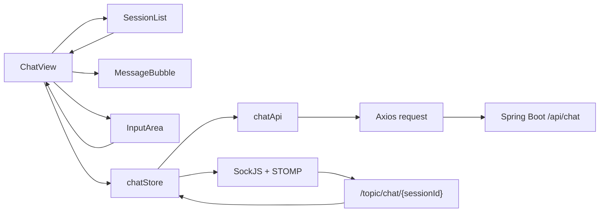

API 层职责：

- `api/chatApi.ts` 封装 `startSession`、`sendMessage`、`getHistory`、`getSessions`、`deleteSession`。
- 所有请求复用 `api/index.ts` 的 Axios 实例，因此会自动携带 `Authorization: Bearer <token>`。
- HTTP 发送消息调用 `POST /api/chat/message`，当前后端会保存用户消息并返回固定 AI 回复。

Store 职责：

- `stores/chatStore.ts` 维护当前会话、会话列表、消息列表、加载状态、发送状态和 WebSocket 连接状态。
- `startNewSession` 创建会话后设置当前会话，并建立 WebSocket 订阅。
- `switchSession` 根据会话 ID 加载历史消息，并切换 WebSocket 订阅目标。
- `sendMessage` 会先添加乐观用户消息，再调用后端发送接口，最后追加 AI 回复。
- `deleteSession` 删除会话后同步本地列表；如果删除的是当前会话，会清空消息并断开 WebSocket。
- `connectWebSocket` 使用 SockJS 连接 `/ws/chat`，并通过 STOMP header 携带 JWT。

组件职责：

- `SessionList` 负责展示会话、创建入口、切换事件和删除事件。
- `MessageBubble` 负责用户/AI 气泡展示、Markdown 渲染和时间格式化。
- `InputArea` 负责输入框、发送按钮、Enter 发送、Shift+Enter 换行和发送 loading。
- `ChatView` 负责把路由参数、Store、会话列表、消息区和输入区编排成完整聊天页面。

聊天流：

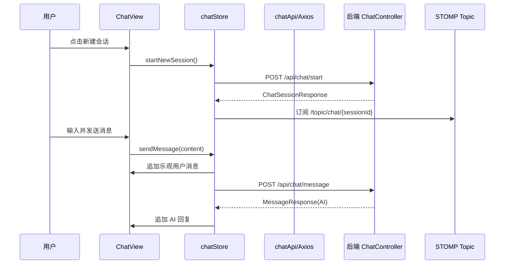

WebSocket 约定：

- 连接端点为 `/ws/chat`，通过 Vite 代理转发到后端 `8085`。
- 订阅目标为 `/topic/chat/{sessionId}`。
- STOMP `CONNECT` header 携带 `Authorization: Bearer <token>`，与后端 WebSocket 控制器解析逻辑一致。
- 当前前端发送消息走 HTTP，WebSocket 主要用于接收服务端推送；这样避免 HTTP 和 WebSocket 双写造成消息重复。

设计约束：

- 当前 AI 回复仍来自后端固定字符串，符合 MVP 阶段边界。
- 前端乐观消息使用负数临时 ID，只存在于当前页面内；重新加载历史时以后端消息为准。
- Markdown 渲染关闭 HTML，降低用户输入造成 XSS 的风险。
- WebSocket 断线不会阻塞 HTTP 聊天流程，页面会显示 `HTTP 模式`，发送和历史查询仍可用。
- 聊天页初始化加载会话失败时会保留页面框架，并显示错误提示和重新加载入口，避免接口异常或登录态问题表现为纯白屏。
- 开发服务通过 Vite `server.headers` 返回 `Cache-Control: no-store`，减少开发阶段浏览器复用旧模块造成的前端状态错乱。

## 前端漫剧模块

Phase 12 补齐前端漫剧模块，围绕后端 Phase 7 的 `/api/story/*` REST 接口实现漫剧列表、详情、编辑、删除，以及从聊天会话触发剧情大纲生成。

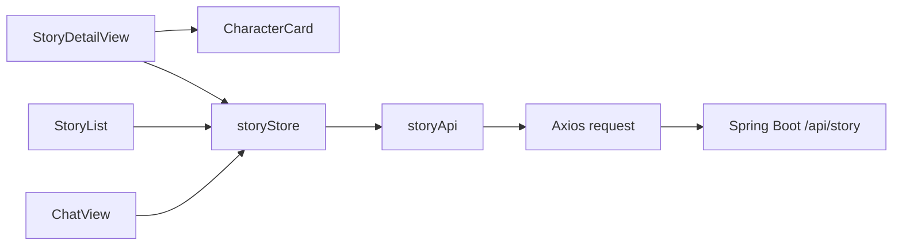

API 层职责：

- `api/storyApi.ts` 封装 `getStories`、`getStoryDetail`、`generateStory`、`updateStory`、`deleteStory`。
- 所有 story 请求复用统一 Axios 实例，自动携带 JWT，并沿用 401 统一跳转登录逻辑。
- `GET /api/story/list` 读取 MyBatis-Plus 分页对象，前端从 `records/current/size/total/pages` 维护分页状态。

Store 职责：

- `stores/storyStore.ts` 维护 `stories`、`currentStory`、`pagination`、`isLoading`、`isGenerating`。
- `fetchStories` 同步列表和分页状态，并对异常结构兜底为空数组。
- `fetchStoryDetail` 加载当前详情，包括 `fullContent` 和主要角色列表。
- `generateStory` 调用后端剧情大纲生成接口，并把新草稿插入本地列表顶部。
- `updateStory` 更新列表和当前详情，`deleteStory` 删除列表项并清理当前详情。

页面与组件职责：

- `StoryList` 使用卡片网格展示漫剧，支持当前页内标题/摘要搜索、类型筛选、状态筛选、分页和删除确认。
- `StoryDetailView` 展示标题、类型、风格、状态、故事摘要、剧情大纲和主要角色卡片，并提供编辑、删除和大纲修改入口。
- `CharacterCard` 负责角色头像占位、名称、角色定位、描述、性格和外观字段展示。
- `ChatView` 在当前会话存在时提供“生成剧情大纲”按钮，点击后要求输入题材和可选剧情，再调用后端生成接口。

生成流：

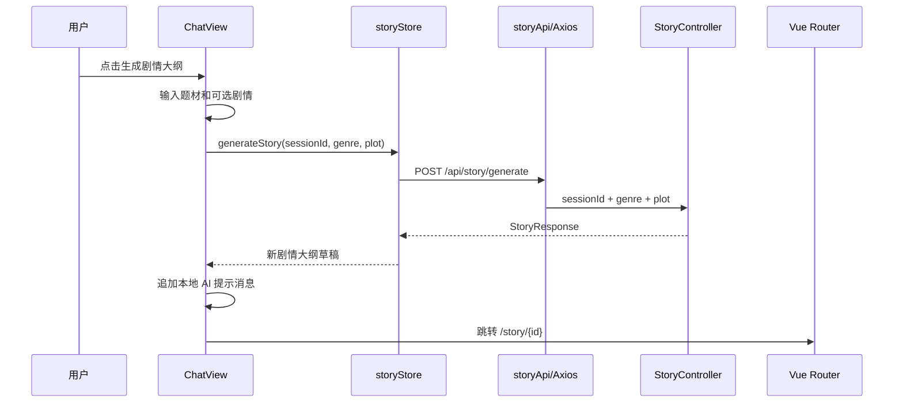

设计约束：

- 当前列表筛选为前端当前页筛选，因为后端 Phase 7 接口尚未提供搜索、类型、状态查询参数。
- 当前封面生成为预留按钮，真实图片生成需要后续 AI 图片能力或文件上传流程接入。
- 后端 `StoryResponse` 当前未返回 `updatedAt`，列表暂以 `createdAt` 展示时间；若后续需要精确更新时间，可以扩展后端 DTO。
- `/api/story/generate` 现在语义为生成剧情大纲，后端会调用 Python FastAPI 的 `/api/story/outline`。
- Java 后端通过 `AiEngineClient` 隔离 Python 调用细节；Python 真实生成逻辑后续只需要替换 `python-ai/main.py` 中的占位实现。

## Python AI 引擎调用骨架

当前 Java 后端已经搭建了调用 FastAPI 的函数边界，用于后续接入 LangChain 或其他 Python 生成逻辑。

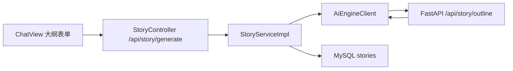

接口契约：

- Java 对外接口仍为 `POST /api/story/generate`，请求体为 `sessionId`、`genre`、`plot`。
- Java 到 Python 的接口为 `POST ${ai.engine.base-url}${ai.engine.story-outline-path}`，默认 `http://localhost:5000/api/story/outline`。
- Python 请求字段为 `userId`、`sessionId`、`sessionTitle`、`genre`、`plot`。
- Python 内部使用 `with_structured_output(NovelOutlineOutput)` 约束模型输出，固定生成 `novel_name`、`story_summary`、`outline`、`main_characters`。
- Python 对 Java 的 HTTP 响应映射为 `novelName`、`storySummary`、`outline`、`mainCharacters`。
- Java 保存时将 `novelName` 写入 `stories.title`，将请求题材写入 `stories.genre`，将 `storySummary` 写入 `stories.synopsis`，将 `outline` 写入 `stories.full_content`，将 `mainCharacters` 写入 `characters` 表。
- Tongyi API Key 从 `python-ai/api.yml` 的 `tongyi.api_key` 读取，启动时写入 `DASHSCOPE_API_KEY` 环境变量。

设计约束：

- Java 后端负责用户鉴权、会话归属校验、保存剧情大纲草稿。
- Python FastAPI 负责生成剧情大纲内容，当前 `python-ai/main.py` 已搭好 LangChain `ChatTongyi.with_structured_output()` 调用链。
- 如果 FastAPI 服务未启动或接口未实现，Java 会返回清晰错误：`Python 剧情大纲接口暂不可用`。
- `python-ai/api.yml` 是本地密钥文件，已加入 `.gitignore`，不要提交到仓库。

大纲修改链路：

- 前端详情页提供“大纲修改”按钮，用户输入修改意见后调用 `POST /api/story/{id}/outline/revise`。
- Java 后端会校验 story 归属，将原始标题、摘要、大纲和修改意见转发给 Python FastAPI。
- Python FastAPI 暂提供 `/api/story/outline/revise` 占位路由，后续在该路由中替换为真实 LangChain 修订链。
- Java 收到修订响应后更新 `stories.synopsis`、`stories.full_content`，如返回新的主要角色，则替换 `characters` 表中的角色设定。

## 前端用户中心模块

Phase 13 补齐用户中心页面，将用户资料、头像上传、账号编辑和创作统计统一到 `/user`。该模块复用 Phase 10 的认证 Store、Phase 11 的聊天 Store、Phase 12 的漫剧 Store，并通过文件 API 接入后端 Phase 8 的本地文件存储。

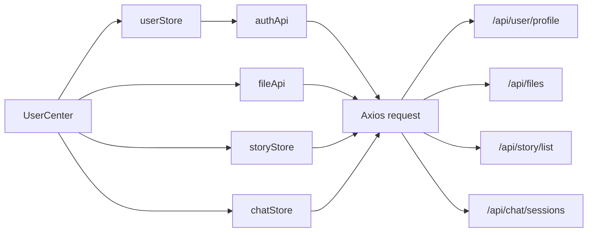

页面职责：

- `UserCenter` 展示头像、用户名、邮箱、注册时间、用户 ID、头像路径、漫剧数量和对话数量。
- 页面初始化会调用 `userStore.fetchProfile()` 拉取最新用户资料。
- 漫剧统计复用 `storyStore.fetchStories(1, 1)` 的分页总数，避免为统计额外新增后端接口。
- 对话统计复用 `chatStore.loadSessions()` 的列表长度。
- 编辑弹窗通过 `userStore.updateProfile()` 更新用户名和邮箱，并同步 `localStorage.userInfo`。

头像上传职责：

- `api/fileApi.ts` 封装 `uploadFile(file, category)` 和 `loadFileBlob(filePathOrUrl)`。
- 头像上传使用 Element Plus `el-upload`，分类固定为 `avatars`。
- 上传成功后调用 `userStore.updateProfile({ avatarPath: fileUrl })`，把后端返回的文件 URL 写入用户资料。
- 因 `/api/files/**` 当前仍受 JWT 保护，头像预览不会直接使用 `` 拉取，而是通过 Axios 携带 Authorization 获取 Blob，再转换为 `objectURL` 展示。

设计约束：

- 统计卡片以现有接口聚合为主，不新增后端统计接口；如果后续数据量增大，可以新增 `/api/user/stats` 汇总接口。
- 头像只允许图片类型且前端限制 10MB，后端仍会执行扩展名、Content-Type、路径和大小校验。
- 如果头像文件不存在或访问失败，页面回退到文字头像，不阻断用户中心渲染。
- 文件 Blob 预览在组件卸载或头像变更时会主动 `URL.revokeObjectURL`，避免浏览器内存泄漏。

## 剧情大纲生成等待与进度输出

剧情大纲生成链路需要适配大模型调用耗时较长的特点，因此 Java 到 Python FastAPI 的调用只限制连接建立时间，读取响应不设置上限。这样 Python 服务已经接收请求并开始生成后，Java 后端会一直等待最终结构化 JSON 返回，不会因为生成时间长而主动超时中断。

Python `generate_story_outline` 继续使用 `with_structured_output(NovelOutlineOutput)` 约束输出结构，固定返回 `novelName`、`storySummary`、`outline`、`mainCharacters`。同时 Python 控制台会通过 LangChain callback 和阶段日志打印请求接收、模型调用开始、流式 token、模型完成、响应封装等进度；如果当前 Tongyi structured output 链路没有透出 token callback，仍会保留阶段级进度日志，不影响最终结果返回。

## 手动编辑与分卷大纲模块

剧情大纲详情现在拆为三个主要内容区：`stories.full_content` 保存剧情大纲，`characters` 表保存主要角色设定，`story_volume_outlines` 表保存分卷大纲。`stories` 与 `story_volume_outlines` 是一对多关系，一个故事可以拥有多个分卷大纲记录。前端详情页提供“手动修改大纲/角色”弹窗，用户可以基于现有文本直接修改故事摘要、剧情大纲和角色设定；保存时调用 `PUT /api/story/{id}/detail`，Java 后端校验 story 归属后更新 `stories.synopsis`、`stories.full_content`，并用提交的角色列表整体替换当前 story 的 `characters` 数据。

分卷大纲生成由前端详情页“分卷大纲生成”按钮触发，调用 `POST /api/story/{id}/volume-outline/generate`。Java 后端读取当前 story 的标题、摘要、剧情大纲和角色设定，转发给 Python FastAPI `/api/story/volume-outline`。Python 侧通过 LangChain `with_structured_output(VolumeOutlineOutput)` 固定返回 `volumes` 数组，提示词要求每卷尽可能提供更多剧情细节、冲突、反转、角色选择、情绪钩子和卷末悬念。Java 收到结果后会替换当前 story 的旧分卷，并逐条写入 `story_volume_outlines` 表，再返回最新详情给前端展示。

## 对话绑定漫剧

每个新建对话都必须绑定一个 story。前端在新建对话时会先读取漫剧列表，用户选择一个已有漫剧后再调用 `POST /api/chat/start`，请求体包含 `storyId` 和可选 `title`。后端在 `ChatService.startSession` 中校验 story 归属后，把 `stories.id` 写入 `chat_sessions.story_id`，前端 `ChatSessionResponse` 会拿到 `storyId` 并在聊天页显示“查看绑定漫剧”入口。这样聊天不再只是孤立消息流，而是围绕一部固定漫剧持续迭代。

剧情大纲生成现在以“会话绑定 story”为写入目标。`POST /api/story/generate` 会先校验会话归属，然后读取 `chat_sessions.story_id` 对应的 story，并把 Python 返回的小说名、故事摘要、剧情大纲和主要角色设定写回这个绑定 story。用户可以在同一个对话里随时重新生成剧情大纲，结果会覆盖并更新绑定 story，而不是创建新的 story。

对话内修改也作用于绑定 story。`POST /api/chat/message` 保存用户消息后，会调用 Python `/api/chat/agent` 做问题重写、路由分发和方法参数生成；Java 再按白名单执行对应方法，将结果同步保存到绑定 story。

## 对话 Agent 调度链

对话消息采用 Java 接入、Python 决策、Java 执行的工具调用模式。前端发送 `POST /api/chat/message` 后，Java 后端先校验当前用户、会话归属和绑定 story，再保存用户消息。随后 Java 通过 `AiEngineClient.runChatAgent` 调用 Python FastAPI `/api/chat/agent`。

Python Agent 会完成问题重写、路由分发和大模型结构化输出，固定返回 `rewrittenQuestion`、`route`、`javaMethod`、`javaMethodArgs`、`assistantMessage`。其中 `javaMethod` 表示希望 Java 执行的方法，`javaMethodArgs` 是对应参数。当前白名单支持 `story.updateOutline` 和 `story.none`：前者更新绑定漫剧的摘要、剧情大纲和主要角色设定，后者只返回回复不改数据库。

Java 不会执行 Python 返回的任意方法名，而是通过白名单分发。这样 Python 负责理解用户意图和组织参数，Java 负责权限校验、数据库写入和业务一致性。后续如果要加入分卷大纲生成、章节生成、角色增删等能力，只需要同时扩展 Python Agent 提示词和 Java 白名单方法。
## 分卷大纲修改模块

分卷大纲现在支持“自动修改”和“手动修改”两条入口，二者都复用已有的一对多表 `story_volume_outlines`，不会新增数据库表。核心原则是：前端负责收集修改意图或编辑后的文本，Java 后端负责登录用户和 story 归属校验、事务保存与统一响应，Python FastAPI 只负责大模型生成和结构化输出。

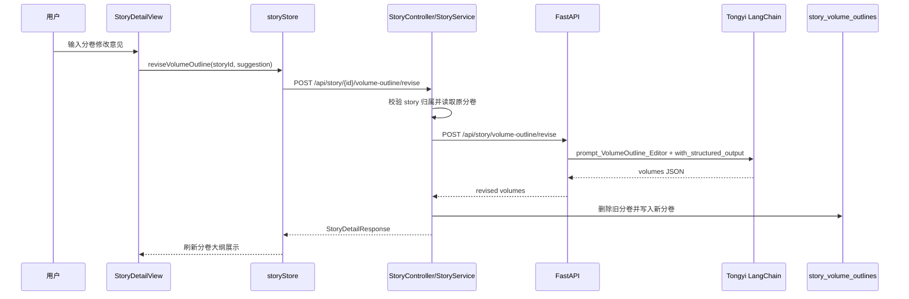

自动修改链路中，Java 会把标题、故事摘要、剧情大纲、主要角色设定、现有分卷大纲和用户修改意见全部发送给 Python `/api/story/volume-outline/revise`。Python 使用 `prompt_VolumeOutline_Editor` 组织提示词，并通过 `with_structured_output(VolumeOutlineOutput)` 固定返回 `volumes` 数组，字段保持为 `volumeNumber`、`title`、`summary`、`content`、`endingHook`。Java 收到结果后整体替换当前 story 的分卷大纲，避免局部更新造成卷序错乱或残留旧数据。

手动修改链路不经过 Python。`StoryDetailView` 会把当前 `volumeOutlines` 预填到弹窗，用户可以直接编辑卷号、卷名、摘要、详细大纲和卷末钩子，也可以新增或删除分卷。保存时前端调用 `PUT /api/story/{id}/volume-outline`，Java 后端校验后同样整体替换 `story_volume_outlines`，并返回最新 `StoryDetailResponse` 给前端刷新。

## 分卷大纲两阶段生成

分卷大纲生成从“一次性生成全部分卷”调整为“两阶段逐卷生成”。第一阶段由 Python FastAPI 使用温度为 0 的 `llm_temperature_0` 判断总分卷数，并通过 `with_structured_output(VolumeCountOutput)` 约束输出为 `volume_count`，范围为 5 到 20。第二阶段按卷号循环调用单卷生成提示词，每次只生成当前一卷。

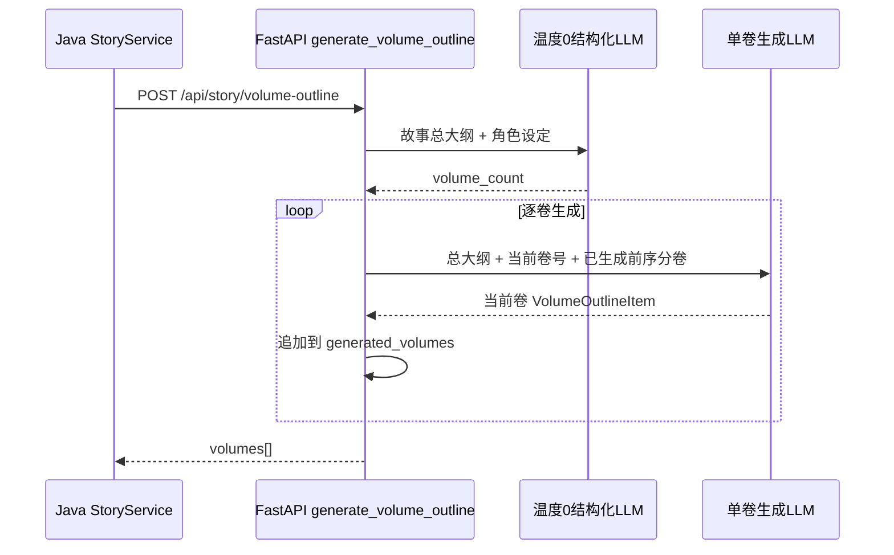

逐卷生成时，提示词会同时携带故事总大纲、主要角色设定、总分卷数、当前卷号和已经生成的前序分卷大纲。这样后续分卷必须承接前序卷的卷末钩子、未解决危机、伏笔、人物关系变化和代价，避免一次性生成时常见的卷与卷之间断层、重复事件或战力跳级问题。

## Python AI 文件拆分

Python AI 引擎现在按业务边界拆分为入口、通用运行时、故事生成和对话 Agent 四个文件。`main.py` 不再承载具体大模型调用，只创建 FastAPI app 并挂载两个业务 router；这样对话系统和其他大模型调用在文件层面分离，后续扩展对话 Agent 不会影响剧情/分卷生成链路。

```mermaid
flowchart LR
    Main["main.py FastAPI app"]
    Runtime["ai_runtime.py LLM runtime"]
    StoryAI["story_ai.py story/outline/volume APIs"]
    ChatAI["chat_ai.py chat agent API"]
    Prompt["prompt.py prompts"]
    Java["Java AiEngineClient"]

    Main --> StoryAI
    Main --> ChatAI
    StoryAI --> Runtime
    ChatAI --> Runtime
    StoryAI --> Prompt
    ChatAI --> Prompt
    Java -->|/api/story/*| StoryAI
    Java -->|/api/chat/agent| ChatAI
```

文件职责如下：

- `ai_runtime.py`：读取 `api.yml` 中的通义 API Key，初始化 `llm_temperature_0`、`structured_llm_base`，并提供 `ConsoleStreamingCallback` 与 `log_progress`。
- `story_ai.py`：负责剧情大纲生成、剧情大纲修改、分卷大纲生成、分卷大纲自动修改，所有 `/api/story/*` Python 接口都在这里。
- `chat_ai.py`：负责对话 Agent，即 `/api/chat/agent`，用于问题重写、路由分发和 Java 方法参数生成。
- `main.py`：只负责 FastAPI app 创建和 router 挂载，保留 `uvicorn main:app` 启动方式。
## 非对话 AI 异步消息队列架构

除对话系统外，剧情大纲、剧情大纲修改、分卷大纲生成、分卷大纲自动修改都改为 RabbitMQ 异步链路。Java 不再通过 HTTP 同步等待 Python 大模型结果，而是先把任务写入 `aisay.ai.story.request`，接口立即返回当前 story 状态；Python 后台 worker 消费任务并调用 LangChain，完成后把结构化 JSON 写入 `aisay.ai.story.result`；Java 监听结果队列后统一更新 `stories`、`characters` 和 `story_volume_outlines`。

```mermaid
sequenceDiagram
    participant Frontend as 前端
    participant Java as Java StoryService
    participant RequestQ as RabbitMQ request queue
    participant Python as Python rabbitmq_worker
    participant LLM as LangChain/Tongyi
    participant ResultQ as RabbitMQ result queue
    participant DB as MySQL

    Frontend->>Java: 提交生成/修改请求
    Java->>DB: 创建或标记 story 为处理中
    Java->>RequestQ: 发布 AiStoryTaskMessage
    Java-->>Frontend: 立即返回当前 story
    Frontend->>Java: 轮询 story 详情
    Python->>RequestQ: 消费任务
    Python->>LLM: 调用非对话大模型能力
    LLM-->>Python: structured JSON
    Python->>ResultQ: 发布 AiStoryTaskResultMessage
    Java->>ResultQ: 监听结果
    Java->>DB: 保存故事/角色/分卷结果并恢复 draft 或标记 failed
    Java-->>Frontend: 轮询拿到最新结果
```

模块职责：
- `RabbitMqConfig` 声明 `aisay.ai.exchange`、请求队列、结果队列和 JSON 消息转换器。
- `AiStoryTaskPublisher` 只负责发布非对话 AI 任务。
- `AiStoryTaskResultListener` 监听 Python 完成消息，并调用 `StoryServiceImpl.applyStoryTaskResult` 落库。
- `StoryServiceImpl` 负责业务状态流转：`generating`、`revising`、`volume_pending`、`failed`、`draft`。
- `rabbitmq_worker.py` 负责连接 RabbitMQ、消费故事类 AI 任务、复用 `story_ai.py` 的生成函数并发布结果。
- `AiEngineClient` 现在只保留对话 Agent 的同步 HTTP 调用，聊天系统仍按原链路工作。
- 前端详情页通过 `refreshStoryDetail` 每 5 秒轮询后台结果，任务完成后自动显示最新大纲或分卷。

### 分卷逐卷回传

分卷生成链路不再等所有卷生成完才回传。`story_ai.generate_volume_outline` 在循环生成每一卷后触发 `on_volume_generated` 回调，`rabbitmq_worker` 会把这一卷包装成 `partial=true` 的 `AiStoryTaskResultMessage` 发送给 Java。Java 收到 partial 消息后按 `storyId + volumeNumber` 覆盖写入单卷数据，story 状态继续保持 `volume_pending`；Python 全部生成结束后再发送 `completed=true` 的完成消息，Java 才把 story 状态恢复为 `draft`。

```mermaid
sequenceDiagram
    participant Python as Python generate_volume_outline
    participant ResultQ as RabbitMQ result queue
    participant Java as Java ResultListener
    participant DB as story_volume_outlines
    participant Frontend as StoryDetailView polling

    loop 每生成一卷
        Python->>ResultQ: partial=true, volumes=[当前卷]
        Java->>ResultQ: 消费当前卷消息
        Java->>DB: 按 storyId + volumeNumber 覆盖写入
        Frontend->>Java: 轮询 story 详情
        Java-->>Frontend: 返回已生成的分卷列表
    end
    Python->>ResultQ: completed=true
    Java->>DB: story.status = draft
```

这个设计让用户能在详情页逐步看到分卷结果，也避免 RabbitMQ 消息重投时插入重复卷。

### 分卷小节故事生成

分卷大纲不再直接生成并保存到 `story_volume_outlines.detailed_content`。新的正文细化链路会先把某一卷拆成 4 到 12 个小节，再逐节生成具体故事细节；每个小节独立保存到 `story_volume_sections`，和分卷形成“一卷多节”的关系。这样单卷内容可以边生成边回传，后续也更容易继续扩展到小节编辑、重生成和章节正文生成。

```mermaid
sequenceDiagram
    participant View as StoryDetailView
    participant Java as StoryController/StoryService
    participant RequestQ as RabbitMQ request queue
    participant Python as rabbitmq_worker/story_ai
    participant LLM as Tongyi
    participant ResultQ as RabbitMQ result queue
    participant DB as story_volume_sections

    View->>Java: POST /api/story/{id}/volume-outline/{volumeId}/sections/generate
    Java->>DB: 清空当前分卷旧小节
    Java->>RequestQ: VOLUME_SECTION_GENERATE
    Java-->>View: 返回 volume_section_pending 状态
    Python->>RequestQ: 消费指定分卷小节生成任务
    Python->>LLM: 先判断小节数量
    loop 每生成一节
        Python->>LLM: 结合总大纲、分卷大纲和前序小节生成当前节
        Python->>ResultQ: partial=true, volumeSection.sections=[当前节]
        Java->>ResultQ: 监听当前小节
        Java->>DB: 按 volumeId + sectionNumber 覆盖写入
    end
    Python->>ResultQ: completed=true
    Java->>ResultQ: 监听结果
    Java->>DB: story.status = draft
    View->>Java: 轮询故事详情
    Java-->>View: 返回分卷与 sections 列表
```

这个能力仍属于“非对话大模型调用”，因此不走 `AiEngineClient` 的同步 HTTP，而是沿用 RabbitMQ 异步任务链路。Python worker 每生成一节就发送 partial 消息，Java 监听后立即落库，前端通过详情页轮询逐步展示小节卡片。旧的 `detailed_content` 字段保留为兼容历史数据，新功能入口和页面展示都以 `story_volume_sections` 为准。

### 小节人物/场景资产架构

小节生成完成后，Python 会继续对当前小节做一次温度为 0 的结构化识别，输出本节实际出场的人物和场景。Java 在提交任务时会把当前故事已有 `story_assets` 作为 `existingAssets` 传给 Python；Python 以 `assetType + name` 判断是否首次出现。首次出现时调用豆包图片生成接口生成人物设定图或场景概念图，并保存到 Java 文件服务可读取的共享本地目录 `backend/storage/generated-assets`；非首次出现时直接复用已有图片路径和人物音频路径。

当前资产生成入口已经从“小节生成流程”中拆出，改为每个小节卡片上的独立按钮。小节生成只负责产出故事细节；用户点击“生成人物/场景图片”后，Java 才发布 `SECTION_ASSET_GENERATE` 任务。这样可以避免每次生成文字小节时都触发昂贵的图片调用，也允许用户按需为某个小节补图或重跑资源识别。

资产去重不依赖本地图片文件名。图片文件名通常是 UUID 或下载后的随机文件名，不能表达“这是哪个人物/场景”。系统以 `story_assets` 作为故事级资产索引，去重时把已有资产的类型、名称、描述、图片提示词、图片路径、音频路径传给通义模型。模型需要为当前小节识别出稳定的人物/场景名称，并在确认与已有资产是同一对象时返回 `matchedExistingName`。Python 优先按 `matchedExistingName` 复用已有资产；只有没有匹配到已有资产时才调用豆包文生图并创建新资产。如果已有资产记录存在但图片路径为空，则复用该资产记录并补调豆包生成图片。

```mermaid
sequenceDiagram
    participant Java as Java StoryService
    participant Python as Python story_ai
    participant LLM as Tongyi temperature=0
    participant Doubao as Doubao Image
    participant FS as Local storage
    participant DB as MySQL
    participant View as StoryDetailView

    View->>Java: POST /api/story/{id}/volume-sections/{sectionId}/assets/generate
    Java->>Python: SECTION_ASSET_GENERATE + section + existingAssets
    Python->>LLM: 从小节内容识别 characters/scenes
    alt 首次出现
        Python->>Doubao: images.generate(prompt)
        Doubao-->>Python: image url
        Python->>FS: 保存 generated-assets/date/file.png
        Python-->>Java: asset firstAppearance=true + imagePath
    else 已存在
        Python-->>Java: asset firstAppearance=false + imagePath/audioPath
    end
    Java->>DB: upsert story_assets
    Java->>DB: 写入 story_section_assets 关联
    View->>Java: GET /api/story/{id}
    Java-->>View: section.assets + imageUrl/audioUrl
    View->>Java: POST /api/story/{id}/assets/{assetId}/audio
    Java->>FS: 保存 character-audio/date/file
    Java->>DB: 更新 story_assets.audio_path
```

数据职责如下：
- `story_assets`：故事级资源库，保存人物/场景名称、描述、图片提示词、本地图片路径、人物音频路径和首次出现的小节。
- `story_section_assets`：小节与资源的多对多关联表，表示某个小节出现了哪些人物和场景。
- `backend/storage/generated-assets`：Python 调豆包生成后的图片落地目录，通过 Java `/api/files/...` 读取。
- `backend/storage/character-audio`：用户上传的人物音频目录，由 Java 上传接口写入并绑定到人物资产。

### 故事级漫剧风格

`stories.style` 是当前故事的统一视觉风格来源。用户在“生成剧情大纲”时必须选择或输入漫剧风格，Java 会把该值保存到故事主记录；故事详情页也允许继续编辑这个字段。后续所有新生成的人物图片、场景图片和视频生成链路，都应读取同一个 `stories.style`，避免不同阶段生成出的画面风格漂移。

风格传递链路如下：
- 前端 `ChatView` 生成剧情大纲表单提交 `style`。
- Java `StoryServiceImpl.generateStory` 保存 `stories.style`，并通过 `AiStoryTaskMessage.storyStyle` 传给 Python 剧情大纲任务。
- Java `StoryServiceImpl.generateVolumeSections` 提交小节生成任务时再次传递 `storyStyle`。
- Python `StoryVolumeSectionGenerateRequest.story_style` 进入人物/场景识别提示词，要求每个 `imagePrompt` 贴合该风格。
- Python `build_doubao_prompt` 调用豆包图片生成前，把用户风格写入最终图片提示词，并要求画面适合后续分镜和视频生成。

历史故事如果没有填写 `style`，Python 图片生成链路会使用“高质量国漫/漫剧视觉”作为兜底；更推荐用户在故事详情页先补齐风格，再生成新小节或新图片资产。未来接入视频生成时，不应单独新增一套风格来源，而应继续从 `stories.style` 读取同一份设定。

### 图片访问与提示词分流

图片文件本体保存在本地文件系统，数据库 `story_assets.image_path` 只保存相对路径，例如 `generated-assets/2026-05-21/xxx.png`。Java 在返回故事详情时会把它转换为 `imageUrl=/api/files/generated-assets/2026-05-21/xxx.png`；前端如果只拿到 `imagePath`，也会自动补成 `/api/files/...`。由于浏览器 `` 请求不会携带 axios 的 Bearer Token，后端只对 `GET /api/files/**` 放行公开读取，上传和删除文件仍走原有鉴权链路。

豆包图片提示词按资产类型分流。通义在 `prompt_SectionAssetExtraction` 中先判断资产是人物还是场景：人物、怪物、拟人角色等进入 `characters`，地点、房间、街区、建筑、战斗场地等进入 `scenes`。Python 根据 `assetType` 自动选择提示词：`CHARACTER` 使用人物三视图提示词，要求同一角色在一张图中展示正面、侧面、背面并保持服装、发型、配色一致；`SCENE` 使用场景概念图提示词，强调空间结构、光影氛围和可复用环境元素。

### 小节故事脚本生成架构

小节故事脚本是独立于人物/场景图片资产之外的异步 AI 能力。用户在故事详情页的某个小节上点击“生成故事脚本”后，前端调用 `POST /api/story/{id}/volume-sections/{sectionId}/script/generate`；Java 校验故事归属和小节内容后，把故事标题、视觉风格、故事摘要、总大纲、主要角色、当前分卷大纲和当前小节内容封装为 `SECTION_SCRIPT_GENERATE` 消息投递到 `aisay.ai.story.request`。接口立即返回，前端继续按既有轮询机制刷新详情。

```mermaid
sequenceDiagram
    participant View as StoryDetailView
    participant Java as StoryService
    participant RequestQ as RabbitMQ request queue
    participant Python as story_ai/rabbitmq_worker
    participant LLM as Tongyi structured output
    participant ResultQ as RabbitMQ result queue
    participant DB as story_section_scripts

    View->>Java: POST /api/story/{id}/volume-sections/{sectionId}/script/generate
    Java->>RequestQ: SECTION_SCRIPT_GENERATE + section context
    Java-->>View: 返回 section_script_pending
    Python->>RequestQ: 消费小节脚本生成任务
    Python->>LLM: 根据小节故事生成总时长和分镜脚本
    LLM-->>Python: sectionScript JSON
    Python->>ResultQ: 发布 sectionScript 结果
    Java->>ResultQ: 监听结果
    Java->>DB: 清空当前小节旧脚本并写入新分镜
    Java-->>View: 轮询返回 scripts 与 scriptTotalDurationSeconds
```

数据职责如下：
- `story_section_scripts`：保存小节级分镜脚本，一条记录对应一个镜头，包含镜头序号、时长、分镜类型、镜头运动、动作和台词。
- `AiStoryTaskMessage.section`：提交任务时携带当前小节故事正文，避免 Python 再反查 Java。
- `AiStoryTaskResultMessage.sectionScript`：Python 通过 RabbitMQ 回传结构化脚本，Java 负责最终落库。
- `StoryDetailResponse.VolumeSectionItem.scripts`：前端展示小节脚本列表；`scriptTotalDurationSeconds` 用于显示 AI 自行决定的总时长。

### Python Story AI 软件包拆分

`python-ai/story_ai.py` 现在只作为兼容门面存在，负责把 `story_ai_pkg` 的公共对象重新导出。这样 `main.py` 中的 `from story_ai import router as story_router`、`rabbitmq_worker.py` 中的 `from story_ai import generate_story_outline ...` 都不需要改动，但实际实现已经拆成多个职责单一的模块。

当前包结构如下：
- `story_ai_pkg/models.py`：Pydantic 请求/响应模型，包括剧情大纲、分卷、小节、资产和脚本模型。
- `story_ai_pkg/templates.py`：LangChain `PromptTemplate` 初始化，统一绑定 `prompt.py` 中的提示词。
- `story_ai_pkg/router.py`：FastAPI `APIRouter` 单例，其他模块通过导入同一个 router 注册路由。
- `story_ai_pkg/formatters.py`：角色、分卷、小节上下文格式化工具，以及普通文本 LLM 输出解析工具。
- `story_ai_pkg/outline.py`：剧情大纲生成与剧情大纲修改。
- `story_ai_pkg/volumes.py`：分卷大纲生成、分卷大纲修改、分卷正文生成。
- `story_ai_pkg/sections.py`：分卷小节数量判断与逐节故事生成。
- `story_ai_pkg/assets.py`：小节人物/场景识别、已有资产匹配、豆包图片生成和本地文件落地。
- `story_ai_pkg/scripts.py`：小节故事脚本结构化生成。

这个拆分让非对话 AI 能力仍然共享同一个 FastAPI router 和 RabbitMQ worker 入口，但每类能力的代码边界更清楚。后续如果继续增加视频生成、音频合成或镜头图片生成，建议新增独立模块，例如 `video.py` 或 `shot_images.py`，再由 `story_ai_pkg/__init__.py` 做公共导出。

### 大纲题材与漫剧风格配置模块

生成剧情大纲时的“题材”和“漫剧风格”已经从前端写死选项拆成 Java 后端业务配置。该模块不调用 Python、不经过 RabbitMQ，也不参与大模型链路；它只负责维护可选项，真正生成剧情大纲时仍然由 `StoryServiceImpl.generateStory` 把用户选中的字符串保存到 `stories.genre` 和 `stories.style`。

```mermaid
sequenceDiagram
    participant Admin as 大纲配置页
    participant Java as StoryOutlineOptionController
    participant Service as StoryOutlineOptionService
    participant DB as story_outline_options
    participant Chat as 生成剧情大纲弹窗

    Admin->>Java: POST/PUT/DELETE /api/story-outline-options
    Java->>Service: 校验类型、名称唯一、排序和启用状态
    Service->>DB: 写入 story_outline_options
    Chat->>Java: GET /api/story-outline-options?enabled=true
    Java->>DB: 查询 GENRE/STYLE 可用配置
    Java-->>Chat: 返回题材和风格下拉选项
```

数据职责如下：
- `story_outline_options`：全局配置表，`option_type=GENRE` 表示漫剧大纲题材，`option_type=STYLE` 表示漫剧风格。
- `sort_order`：控制前端下拉和管理表格中的展示顺序。
- `enabled`：控制是否出现在“生成剧情大纲”弹窗；停用不会影响已经生成的故事。
- `stories.genre` / `stories.style`：故事主表中的最终业务快照，保存用户创建故事时实际选择或手动输入的文本。

前端职责如下：
- `OutlineOptionManageView`：提供题材/漫剧风格的新增、编辑、启停和删除入口。
- `outlineOptionStore`：封装配置项加载和保存状态，供管理页和生成剧情大纲弹窗复用。
- `ChatView`：打开生成剧情大纲弹窗时加载已启用配置，并允许用户临时手动输入未配置的题材或风格。

这个拆分的好处是配置维护可以快速迭代，不需要重启或修改 AI 提示词；同时故事记录保留字符串快照，后续删除或改名配置项不会破坏历史故事数据。

### Prompt 管理模块

Prompt 管理把原来写死在 `python-ai/prompt.py` 中的模板迁移到 MySQL。Java 后端负责管理页面和 CRUD，Python 运行时只通过 `pymysql` 按 `prompt_key` 只读获取启用模板，并把模板作为 LangChain 参数使用；`prompt.py` 暂时保留为兜底，避免数据库未初始化时 AI 服务直接启动失败。

```mermaid
sequenceDiagram
    participant View as PromptManageView
    participant Java as AiPromptController
    participant DB as MySQL ai_prompts
    participant Python as prompt_repository
    participant LLM as LangChain Chain

    View->>Java: GET/POST/PUT/DELETE /api/prompts
    Java->>DB: 管理 Prompt 模板和参数详情
    Python->>DB: 只读 SELECT template_content WHERE prompt_key=? AND enabled=1
    DB-->>Python: Prompt 模板正文
    Python->>LLM: PromptTemplate.from_template(template)
```

数据职责如下：
- `ai_prompts`：保存 Prompt 主体信息，包括 `prompt_key`、名称、分类、说明、模板正文和启用状态。
- `ai_prompt_parameters`：保存每个 Prompt 的输入参数和输出参数说明，包括参数标识、名称、类型、是否必填、说明和示例。
- `prompt_key`：Python 与数据库之间的稳定契约，例如 `generate_story_outline`、`generate_section_script`、`chat_agent`。
- `python-ai/prompt.py`：兼容兜底文件；数据库不可用时 Python 会回退到这里，保证现有服务不断。

当前已纳入数据库管理的 Prompt 包括：
- `generate_story_outline`：输入 `Theme`、`StoryStyle`、`Plot`；输出 `novel_name`、`story_summary`、`outline`、`main_characters`。
- `revise_story_outline`：根据原始大纲和修改意见重写故事大纲。
- `generate_volume_count` 和 `generate_volume_outline_single`：两阶段生成分卷大纲。
- `revise_volume_outline`：自动修改分卷大纲。
- `generate_volume_story`：生成分卷正文。
- `generate_volume_section_count` 和 `generate_volume_section_single`：两阶段生成分卷小节。
- `extract_section_assets`：识别小节人物和场景资产。
- `generate_section_script`：生成小节分镜脚本。
- `chat_agent`：对话系统的问题重写和 Java 方法路由。

Python 读取策略如下：
- 每次构建链路时通过 `load_prompt_template(prompt_key)` 获取模板。
- `prompt_repository` 对每个 `prompt_key` 做 30 秒内存缓存，降低 MySQL 查询频率。
- 如果未安装 `pymysql`、SQL 未执行、MySQL 连接失败或该 `prompt_key` 没有启用记录，则打印 fallback 日志并使用 `prompt.py` 中的原始模板。
- Python 不包含 Prompt 新增、修改、删除逻辑，也不暴露 Prompt 管理接口；这些能力只存在于 Java 的 `/api/prompts`。

维护规则如下：
- 修改模板正文时必须保留 Python 调用时传入的 `{变量名}`，否则 LangChain 渲染会因为缺少变量而报错。
- 输入参数用于说明 PromptTemplate 需要哪些占位符；输出参数用于说明 `with_structured_output()` 或解析逻辑期望返回什么字段。
- 禁用某个 Prompt 后，Python 查询不到启用记录，会回退到 `prompt.py`；如果希望完全阻断某个链路，需要在业务层单独做开关。

### LLM 调用重试

通义大模型调用有时会遇到远端提前关闭连接，例如 `RemoteDisconnected('Remote end closed connection without response')`。这类错误通常不是业务参数问题，而是上游 HTTP 连接的临时波动。Python 在 `ai_runtime.invoke_llm_with_retry` 中统一包裹 LangChain `.invoke()`，对临时网络/上游异常做最多 3 次指数退避重试。

```mermaid
sequenceDiagram
    participant Biz as story_ai/chat_ai
    participant Runtime as invoke_llm_with_retry
    participant LLM as Tongyi API

    Biz->>Runtime: chain + prompt payload
    Runtime->>LLM: invoke attempt 1
    LLM--xRuntime: RemoteDisconnected / timeout / 5xx
    Runtime->>Runtime: 判断为可重试异常，等待退避时间
    Runtime->>LLM: invoke attempt 2/3
    LLM-->>Runtime: 正常响应
    Runtime-->>Biz: 返回 LLM 结果
```

当前重试只覆盖看起来像临时连接或上游服务异常的错误，例如连接中断、超时、连接重置、502、503、504。Prompt 变量缺失、结构化输出解析失败、业务校验失败等非临时错误不会被静默吞掉，仍会直接抛出，便于定位真实问题。
