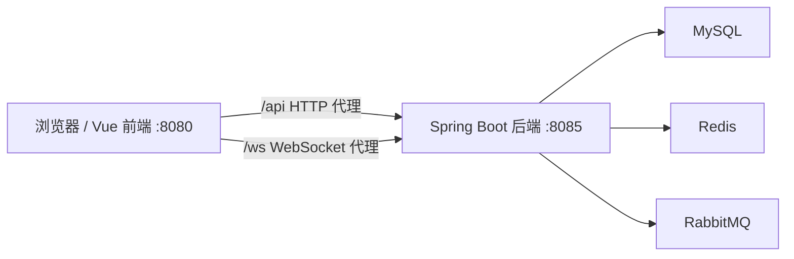
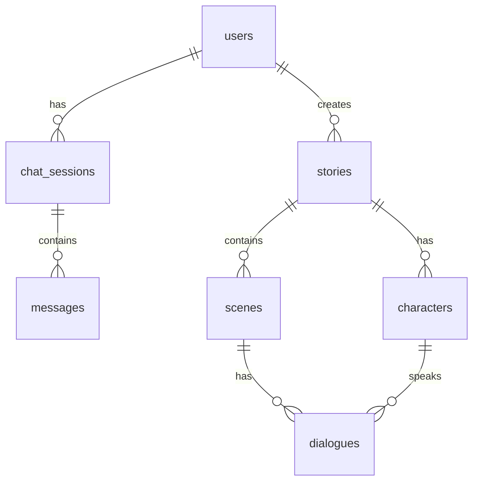
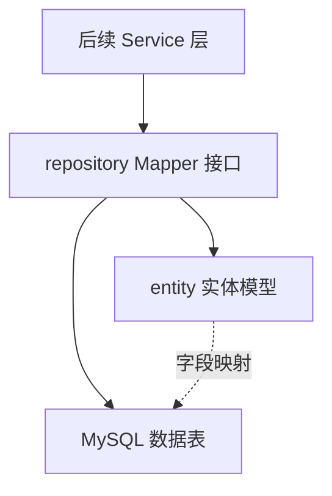
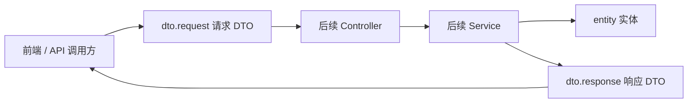

# AI漫剧生成系统模块架构说明

## 当前阶段架构范围

Phase 1 已完成前后端工程骨架搭建，当前架构重点是建立清晰的模块边界、运行入口和基础设施连接配置。AI 引擎、数据库表结构、实体、认证、聊天和漫剧业务逻辑会在后续阶段逐步落入这些模块。

## 后端模块

后端工程位于 `F:\ai\aisay\backend`，主包为 `com.aisay.manga`。当前采用标准 Spring Boot 分层结构，为后续功能留下稳定落点。

- `controller`：REST API 与 WebSocket 控制器入口，后续承载用户、聊天、漫剧、文件等接口。
- `service`：业务接口层，定义用户、聊天、漫剧生成等业务能力。
- `service.impl`：业务实现层，封装流程编排、权限校验、事务处理和模拟 AI 回复逻辑。
- `repository`：数据访问层，后续放置 MyBatis-Plus Mapper。
- `entity`：数据库实体层，对应 users、chat_sessions、messages、stories 等核心表。
- `dto.request`：请求 DTO，隔离外部 API 入参与内部实体。
- `dto.response`：响应 DTO，统一对前端返回的数据结构。
- `config`：Spring Security、MyBatis-Plus、Redis、WebSocket、CORS、Knife4j 等配置类。
- `utils`：JWT、本地文件存储、通用转换等工具类。

后端配置集中在 `backend/src/main/resources/application.yml`。阶段一已经接入 `config.txt` 中的 MySQL、Redis 和 RabbitMQ 地址与账号信息，并设置服务端口为 `8085`。

## 前端模块

前端工程位于 `F:\ai\aisay\frontend`，采用 Vue 3、TypeScript、Vite、Pinia、Vue Router 和 Element Plus。当前入口和目录结构已就绪，页面与业务状态会在后续阶段增量实现。

- `views`：页面级组件，如聊天页、登录页、注册页、漫剧列表、漫剧详情、用户中心。
- `components/chat`：聊天域组件，如消息气泡、输入框、会话列表。
- `components/story`：漫剧域组件，如角色卡片、分镜/故事展示组件。
- `components/common`：跨模块通用组件，如布局、加载态、错误展示。
- `stores`：Pinia 状态管理，后续拆分用户、聊天、漫剧 store。
- `api`：Axios API 封装，后续按认证、聊天、漫剧等领域拆分。
- `router`：Vue Router 配置，阶段一保持空路由表，后续按实现计划逐步加入页面路由和鉴权守卫。
- `types`：前端共享 TypeScript 类型定义。
- `styles`：全局样式、变量和主题入口。

`frontend/vite.config.ts` 已配置开发端口 `8080`，并将 `/api` 与 `/ws` 分别代理到后端 REST 与 WebSocket 服务，保证前端开发阶段不需要硬编码后端地址。

## 基础设施连接

当前配置遵循用户提供的 `config.txt`，不是设计文档中的示例账号。

- MySQL：`jdbc:mysql://localhost:3306/springcloud?...`，用户名 `root`，密码 `root`。
- Redis：`127.0.0.1:6379`，database `0`。
- RabbitMQ：`127.0.0.1:5672`，用户名 `guest`，密码 `guest`。

Phase 2 已选择与 `config.txt` 保持一致，初始化 SQL 默认面向 `springcloud`。如果后续需要切回设计文档中的 `aisay_manga`，需要同步调整 `init.sql` 和 `application.yml`。

## 数据库初始化模块

Phase 2 新增 `backend/src/main/resources/db/init.sql` 作为数据库结构的唯一初始化入口。该文件默认面向当前配置中的 `springcloud` 数据库，包含建库、业务用户授权和 7 张核心业务表。

表职责如下：

- `users`：保存注册用户、邮箱、密码哈希、头像和偏好配置。
- `chat_sessions`：保存用户与 AI 创作助手的会话元数据、当前阶段和进度。
- `messages`：保存会话内用户消息与 AI 消息。
- `stories`：保存漫剧主记录，包括标题、类型、风格、摘要、全文、封面和统计数据。
- `characters`：保存某部漫剧下的角色设定。
- `scenes`：保存某部漫剧下的场景/分镜描述。
- `dialogues`：保存场景中的对白，并可关联到具体角色。

## MyBatis-Plus 配置模块

Phase 2 新增 `com.aisay.manga.config.MyBatisPlusConfig`。该配置类负责注册 MyBatis-Plus 拦截器链，目前包含分页插件和乐观锁插件。

- 分页插件面向 MySQL，用于后续漫剧列表、会话列表等分页查询。
- 乐观锁插件为后续需要版本控制的实体预留能力，避免并发更新覆盖。
- `application.yml` 中集中配置 XML Mapper 扫描路径、实体别名包、下划线转驼峰和全局逻辑删除值。

## Redis 配置模块

Phase 2 新增 `com.aisay.manga.config.RedisConfig`。该配置提供统一的 `RedisTemplate<String, Object>`，避免各业务模块自行配置序列化策略。

- Redis key 和 hash key 使用 `StringRedisSerializer`，保证可读性和跨工具兼容性。
- Redis value 和 hash value 使用 `GenericJackson2JsonRedisSerializer`，便于保存后续会话上下文、缓存对象和任务状态。
- 该配置为后续聊天上下文缓存、用户资料缓存和生成任务状态缓存提供基础设施。

## 实体与数据访问模块

Phase 3 在后端补齐了实体层和 Mapper 层，形成从数据库表到 Java 对象再到数据访问接口的基础通路。

实体层说明：

- `User` 对应 `users`，承载用户账号、邮箱、密码哈希、头像和偏好配置。
- `ChatSession` 对应 `chat_sessions`，承载会话状态、进度、上下文 JSON 和最后活跃时间。
- `Message` 对应 `messages`，承载用户/AI 消息、元数据 JSON 和创建时间。
- `Story` 对应 `stories`，承载漫剧主信息、全文内容、封面和统计字段。
- `Character` 对应 `characters`，承载角色设定；由于 Java 内置 `Character` 已占用 MyBatis 类型别名，该实体显式使用 `MangaCharacter` 别名。
- `Scene` 对应 `scenes`，承载场景序号、场景设定、描述和视觉元素 JSON。
- `Dialogue` 对应 `dialogues`，承载场景对白；SQL 保留字 `order` 通过反引号列名映射。

Mapper 层说明：

- 所有 Mapper 统一放在 `com.aisay.manga.repository`，由主启动类 `@MapperScan` 扫描。
- 基础 CRUD 由 MyBatis-Plus `BaseMapper<T>` 提供，减少重复 SQL。
- `ChatSessionMapper` 提供按用户和状态查询会话，服务后续会话列表。
- `MessageMapper` 提供按会话时间顺序查询消息，服务后续聊天历史。
- `StoryMapper` 提供按用户分页查询漫剧，服务后续个人作品列表。

测试策略：

- `UserMapperTest` 是真实 MySQL 集成测试，但默认跳过。
- 跳过的原因是数据库初始化 SQL 由用户手动执行，自动测试不能假设表已存在。
- 用户执行 `init.sql` 并确认表存在后，可通过 `-Daisay.integration.mysql=true` 显式开启真实数据库验证。

## DTO 模块

Phase 4 新增 DTO 层，用于隔离外部 API 契约、内部业务模型和数据库实体。DTO 不直接访问数据库，也不承载业务流程，只负责请求参数校验和响应数据结构。

请求 DTO 说明：

- 认证相关：`RegisterRequest`、`LoginRequest`。
- 用户资料相关：`UserUpdateRequest`。
- 聊天相关：`ChatStartRequest`、`SendMessageRequest`。
- 漫剧相关：`StoryGenerateRequest`、`StoryUpdateRequest`。
- 基础格式校验使用 Jakarta Bean Validation，例如 `@NotBlank`、`@NotNull`、`@Email`、`@Size`。

响应 DTO 说明：

- `ApiResponse<T>` 是统一响应包装，后续 Controller 默认返回该结构。
- `LoginResponse` 承载登录令牌和用户基础信息。
- `UserProfileResponse` 承载用户中心展示所需信息。
- `ChatSessionResponse` 和 `MessageResponse` 承载聊天页面所需数据。
- `StoryResponse` 承载漫剧列表卡片所需数据。
- `StoryDetailResponse` 继承 `StoryResponse`，扩展全文、角色列表和场景列表，服务漫剧详情页。

边界约定：

- DTO 不暴露 `passwordHash`、`preferences` 等内部字段，避免敏感信息或内部结构泄露到前端。
- DTO 的基础校验只处理格式与必填；唯一性、归属关系、权限控制由后续 Service 和 Security 层承担。
- Entity 与 DTO 之间的转换将在后续 Service 层实现，必要时可增加专门的 converter/assembler。

## 后续演进

Phase 5 到 Phase 8 会在后端现有包结构中继续补齐安全认证、聊天、漫剧、文件与异常处理。Phase 9 之后会在前端现有目录中逐步实现路由、布局、认证、聊天、漫剧和用户中心页面。
