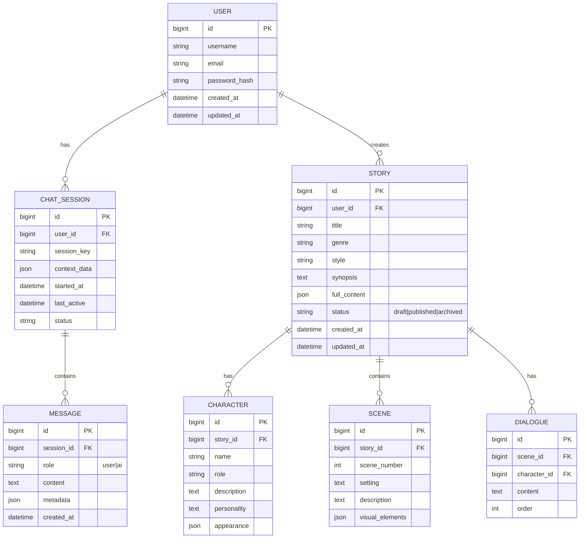

# AI漫剧生成对话系统设计文档

## 1. 系统概述

### 1.1 项目背景
本系统是一个通过自然对话形式与用户交互的AI漫剧生成平台，用户可以通过多轮对话逐步细化需求，AI理解用户意图后自动生成漫画剧本、分镜、角色设定等内容。

### 1.2 设计目标
- **自然对话交互**：用户通过日常对话表达需求，系统智能理解并引导
- **渐进式需求收集**：通过多轮对话逐步完善漫剧设定
- **高质量内容生成**：基于用户需求生成完整的漫剧内容
- **模块化架构**：前后端分离，各模块职责清晰，易于扩展
- **高性能响应**：优化对话体验，减少用户等待时间
- **本地化部署**：所有数据存储在本地文件系统，无需云端依赖

---

## 2. 系统架构

### 2.1 总体架构图
```
┌─────────────┐
│   用户端    │
│   (Vue)     │
└──────┬──────┘
       │ HTTPS/WebSocket
┌──────▼─────────────────────────────────┐
│         业务服务层                       │
│  ┌─────────────┐  ┌─────────────┐  ┌──────────────────┐  │
│  │ 对话服务    │  │ 漫剧生成    │  │ 用户管理服务     │  │
│  │ - 会话管理  │  │ - 剧本生成  │  │ - 用户认证       │  │
│  │ - 消息处理  │  │ - 分镜生成  │  │ - 权限管理       │  │
│  │ - 上下文维护│  │ - 角色设定  │  │ - 用户资料       │  │
│  └──────┬──────┘  └──────┬──────┘  └──────────────────┘  │
│         │                │                                 │
└─────────┼────────────────┼─────────────────────────────────┘
          │                │
┌─────────▼────────────────▼─────────────────────────────────┐
│                   AI引擎层 (LangChain)                     │
│  ┌─────────────────────────────────────────────────────┐  │
│  │              对话理解与生成引擎                      │  │
│  │  ┌─────────────┐  ┌─────────────┐  ┌────────────┐  │  │
│  │  │  意图识别   │  │  状态追踪   │  │  内容生成  │  │  │
│  │  │  Agent      │  │  Memory     │  │  Chain     │  │  │
│  │  └──────┬──────┘  └──────┬──────┘  └──────┬─────┘  │  │
│  │         │                │                │         │  │
│  └─────────┼────────────────┼────────────────┼─────────┘  │
│           │                │                │            │
│  ┌────────▼────────────────▼────────────────▼─────────┐  │
│  │            Prompt模板管理                         │  │
│  │  - 对话引导模板                                   │  │
│  │  - 剧本生成模板                                   │  │
│  │  - 分镜描述模板                                   │  │
│  └───────────────────────────────────────────────────┘  │
│  ┌───────────────────────────────────────────────────┐  │
│  │            本地文件系统集成                       │  │
│  │  - 文件读写工具                                   │  │
│  │  - 资源管理                                       │  │
│  │  - 备份与恢复                                     │  │
│  └───────────────────────────────────────────────────┘  │
│                                                           │
└───────────┼────────────────┼────────────────┼────────────┘
            │                │                │
┌───────────▼────────────────▼────────────────▼────────────────┐
│                    数据存储层                              │
│  ┌─────────────┐  ┌─────────────┐  ┌──────────────────┐  │
│  │  本地数据库  │  │  向量数据库  │  │  本地文件系统    │  │
│  │  (MySQL)    │  │ (Redis/     │  │  (./storage/)    │  │
│  │  - 用户数据  │  │  Chroma)    │  │  - 漫剧资源      │  │
│  │  - 会话记录  │  │  - 向量检索  │  │  - 图片/视频     │  │
│  │  - 漫剧元数据│  │  - 语义缓存  │  │  - 用户头像      │  │
│  └─────────────┘  └─────────────┘  └──────────────────┘  │
└──────────────────────────────────────────────────────────┘
```

### 2.2 技术栈

| 层级 | 技术选型 |
|------|----------|
| **前端** | Vue 3 + TypeScript + Pinia + Vue Router + Axios + Element Plus |
| **后端** | Java 17 + Spring Boot 3.x + MyBatis-Plus + Spring Security |
| **AI引擎** | LangChain + Python + Pydantic + LangSmith |
| **数据库** | MySQL 8.0 (主数据) + Redis (缓存/向量) |
| **消息队列** | RabbitMQ / Kafka |
| **文件存储** | 本地文件系统 (./storage/) |
| **API文档** | Swagger/OpenAPI |
| **开发环境** | MySQL/Redis/RabbitMQ本地原生安装 |

---

## 3. 模块设计

### 3.1 前端模块 (Vue)

#### 3.1.1 核心功能模块
```
src/
├── views/
│   ├── ChatView.vue           # 对话主界面
│   ├── StoryDetailView.vue    # 漫剧详情页
│   ├── StoryList.vue          # 漫剧列表
│   └── UserCenter.vue         # 用户中心
├── components/
│   ├── chat/
│   │   ├── MessageBubble.vue      # 消息气泡组件
│   │   ├── InputArea.vue          # 输入区域
│   │   └── ContextPanel.vue       # 上下文展示面板
│   ├── story/
│   │   ├── StoryCanvas.vue        # 漫剧画布展示
│   │   └── CharacterCard.vue      # 角色卡片
│   └── common/
│       ├── LoadingSpinner.vue
│       └── ErrorBoundary.vue
├── stores/
│   ├── chatStore.ts           # 聊天状态管理
│   ├── storyStore.ts          # 漫剧状态管理
│   └── userStore.ts           # 用户状态管理
└── api/
    ├── chatApi.ts             # 聊天接口
    ├── storyApi.ts            # 漫剧接口
    └── userApi.ts             # 用户接口
```

#### 3.1.2 关键特性
- **实时对话流**：使用WebSocket实现消息实时推送
- **消息历史管理**：本地缓存对话历史，支持离线查看
- **多媒体展示**：支持图片、富文本展示生成的漫剧内容
- **响应式设计**：适配PC、平板、手机多端

### 3.2 后端模块 (Java Spring Boot)

#### 3.2.1 服务分层架构
```
com.aisay.manga/
├── controller/            # REST API控制器
│   ├── ChatController.java
│   ├── StoryController.java
│   ├── UserController.java
│   └── AIEngineController.java
├── service/               # 业务逻辑层
│   ├── impl/
│   │   ├── ChatServiceImpl.java
│   │   ├── StoryGenerationServiceImpl.java
│   │   └── UserServiceImpl.java
│   └── interfaces/
├── repository/            # 数据访问层
│   ├── ChatSessionRepository.java
│   ├── StoryRepository.java
│   └── UserRepository.java
├── entity/                # 实体类
│   ├── ChatSession.java
│   ├── Story.java
│   ├── Character.java
│   └── User.java
├── dto/                   # 数据传输对象
│   ├── request/
│   └── response/
├── config/                # 配置类
│   ├── WebSocketConfig.java
│   ├── AIEngineConfig.java
│   └── SecurityConfig.java
└── utils/                 # 工具类
    ├── AIEngineClient.java    # AI引擎客户端
    └── LocalFileStorageUtil.java  # 本地文件存储工具
```

#### 3.2.2 核心API接口

##### 聊天服务API
```java
POST   /api/chat/start          # 开始新对话会话
POST   /api/chat/message         # 发送消息
GET    /api/chat/history/{id}    # 获取对话历史
DELETE /api/chat/session/{id}    # 删除会话
```

##### 漫剧生成API
```java
POST   /api/story/generate       # 触发漫剧生成
GET    /api/story/{id}           # 获取漫剧详情
GET    /api/story/list           # 获取用户漫剧列表
PUT    /api/story/{id}           # 更新漫剧
DELETE /api/story/{id}           # 删除漫剧
```

##### 用户管理API
```java
POST   /api/auth/register        # 用户注册
POST   /api/auth/login           # 用户登录
GET    /api/user/profile         # 获取用户信息
PUT    /api/user/profile         # 更新用户信息
```

### 3.3 AI引擎模块 (LangChain Python)

#### 3.3.1 架构设计
```python
ai_engine/
├── agents/                    # 智能体模块
│   ├── conversation_agent.py      # 对话理解Agent
│   ├── story_agent.py             # 漫剧生成Agent
│   └── critique_agent.py          # 内容评审Agent
├── chains/                    # 链式处理
│   ├── story_generation_chain.py
│   ├── character_chain.py
│   └── scene_chain.py
├── memory/                    # 记忆管理
│   ├── session_memory.py
│   └── long_term_memory.py
├── prompts/                   # Prompt模板
│   ├── conversation_prompts.py
│   ├── story_prompts.py
│   └── character_prompts.py
├── tools/                     # 自定义工具
│   ├── knowledge_retriever.py
│   ├── style_analyzer.py
│   └── validator.py
└── main.py                    # 服务入口
```

#### 3.3.2 核心组件

##### 对话理解Agent
```python
class ConversationAgent:
    """处理用户对话，理解意图并引导对话流程"""
    
    功能：
    - 意图识别：识别用户当前对话的意图（设定角色、剧情、风格等）
    - 状态追踪：维护对话上下文和漫剧生成进度
    - 问题引导：当信息不足时，主动询问用户补充信息
    - 多轮对话管理：支持上下文理解的连续对话
```

##### 漫剧生成Chain
```python
class StoryGenerationChain:
    """基于收集的信息生成完整漫剧内容"""
    
    步骤：
    1. 角色设定生成 → 2. 剧情大纲生成 → 3. 分镜脚本生成
    4. 对白生成 → 5. 风格描述生成 → 6. 整合输出
    
    支持：
    - 风格定制（日漫、美漫、国漫等）
    - 类型选择（爱情、悬疑、科幻等）
    - 篇幅控制（短篇、中篇、长篇）
```

##### Memory管理
```python
class SessionMemory:
    """会话级别记忆，存储当前对话的上下文"""
    
    存储内容：
    - 对话历史
    - 已确认的漫剧设定
    - 用户偏好
    - 生成进度状态
    
    实现：
    - 使用Redis存储会话上下文，支持快速检索
    - 设置TTL，自动清理过期会话
    - 持久化到MySQL，保证数据不丢失
```

---

## 4. 数据模型设计

### 4.1 核心实体关系



### 4.2 关键数据表结构

#### 用户表 (users)
```sql
CREATE TABLE users (
    id BIGINT AUTO_INCREMENT PRIMARY KEY,
    username VARCHAR(50) UNIQUE NOT NULL,
    email VARCHAR(100) UNIQUE NOT NULL,
    password_hash VARCHAR(255) NOT NULL,
    avatar_path VARCHAR(500),
    preferences JSON,
    created_at TIMESTAMP DEFAULT CURRENT_TIMESTAMP,
    updated_at TIMESTAMP DEFAULT CURRENT_TIMESTAMP ON UPDATE CURRENT_TIMESTAMP,
    INDEX idx_email (email)
);
```

#### 聊天会话表 (chat_sessions)
```sql
CREATE TABLE chat_sessions (
    id BIGINT AUTO_INCREMENT PRIMARY KEY,
    user_id BIGINT NOT NULL,
    session_key VARCHAR(100) UNIQUE NOT NULL,
    title VARCHAR(200),
    context_data JSON,
    current_stage VARCHAR(50),
    progress_percentage INT DEFAULT 0,
    status VARCHAR(20) DEFAULT 'active',
    started_at TIMESTAMP DEFAULT CURRENT_TIMESTAMP,
    last_active TIMESTAMP DEFAULT CURRENT_TIMESTAMP ON UPDATE CURRENT_TIMESTAMP,
    FOREIGN KEY (user_id) REFERENCES users(id) ON DELETE CASCADE,
    INDEX idx_user_id (user_id),
    INDEX idx_last_active (last_active)
);
```

#### 漫剧表 (stories)
```sql
CREATE TABLE stories (
    id BIGINT AUTO_INCREMENT PRIMARY KEY,
    user_id BIGINT NOT NULL,
    title VARCHAR(200) NOT NULL,
    genre VARCHAR(100),
    style VARCHAR(100),
    synopsis TEXT,
    full_content LONGTEXT,
    cover_image_path VARCHAR(500),
    status VARCHAR(20) DEFAULT 'draft',
    view_count INT DEFAULT 0,
    like_count INT DEFAULT 0,
    created_at TIMESTAMP DEFAULT CURRENT_TIMESTAMP,
    updated_at TIMESTAMP DEFAULT CURRENT_TIMESTAMP ON UPDATE CURRENT_TIMESTAMP,
    FOREIGN KEY (user_id) REFERENCES users(id) ON DELETE CASCADE,
    INDEX idx_user_id (user_id),
    INDEX idx_status (status),
    FULLTEXT INDEX ft_title_synopsis (title, synopsis)
);
```

---

## 5. 对话流程设计

### 5.1 标准对话流程

```
开始新对话
    ↓
[AI] 问候用户，询问想要创作什么类型的漫剧？
    ↓
[用户] 我想创作一个科幻爱情故事
    ↓
[AI] 理解意图 → 记录类型：科幻、爱情
    ↓
[AI] 引导问题：主角是什么样的人？有什么特殊能力吗？
    ↓
[用户] 男主角是个程序员，意外获得了读心能力
    ↓
[AI] 记录角色设定 → 继续引导：故事发生在什么时代背景？
    ↓
... (多轮对话收集信息)
    ↓
[AI] 确认：我已经了解了您的想法，要现在生成漫剧吗？
    ↓
[用户] 是的
    ↓
[AI] 调用生成引擎 → 异步处理 → 返回结果
    ↓
结束对话 / 继续修改
```

### 5.2 对话状态机

```python
对话状态 = {
    "INITIAL": "初始状态，等待用户输入",
    "COLLECTING_GENRE": "收集类型信息",
    "COLLECTING_CHARACTERS": "收集角色设定",
    "COLLECTING_PLOT": "收集剧情大纲",
    "COLLECTING_STYLE": "收集风格偏好",
    "CONFIRMING": "确认信息",
    "GENERATING": "生成中",
    "COMPLETED": "完成",
    "REVISION": "修改中"
}
```

### 5.3 意图识别分类

```
1. 创作意图
   - 新建漫剧
   - 继续创作
   - 修改已有内容
   
2. 内容类型
   - 类型设定（科幻、爱情、悬疑等）
   - 风格设定（日漫、美漫、写实等）
   - 篇幅设定（短篇、中篇、长篇）
   
3. 角色相关
   - 添加角色
   - 修改角色
   - 删除角色
   
4. 剧情相关
   - 设定开场
   - 设定高潮
   - 设定结局
   
5. 控制指令
   - 生成漫剧
   - 保存进度
   - 放弃创作
```

---

## 6. AI引擎详细设计

### 6.1 LangChain架构

```python
# 核心组件组合
Agent + Tools + Memory + LLM + Prompts

conversation_agent = Agent(
    llm=ChatAnthropic(model="claude-3-opus"),
    tools=[
        KnowledgeRetrieverTool(),  # 漫剧知识检索
        StoryStructureAnalyzer(),  # 故事结构分析
        StyleValidator()           # 风格验证
    ],
    memory=ConversationBufferMemory(
        memory_key="chat_history",
        return_messages=True
    ),
    prompt=CustomPromptTemplate(
        template=CONVERSATION_PROMPT
    )
)
```

### 6.2 Prompt模板设计

#### 对话引导Prompt
```python
CONVERSATION_PROMPT = """
你是一个专业的漫剧创作助手。你的任务是通过自然对话帮助用户创作漫剧。

当前已收集的信息：
{collected_info}

对话历史：
{chat_history}

用户输入：
{input}

请根据以下规则响应：
1. 如果信息不足，提出1-2个引导性问题
2. 如果信息充分，总结并询问是否生成
3. 保持友好、专业的语气
4. 使用中文对话

当前创作阶段：{current_stage}
"""
```

#### 漫剧生成Prompt
```python
STORY_GENERATION_PROMPT = """
请根据以下设定生成一个完整的漫剧脚本：

【基础设定】
类型：{genre}
风格：{style}
篇幅：{length}

【角色设定】
{characters}

【剧情大纲】
{plot_outline}

【特殊要求】
{special_requirements}

请按照以下格式输出：
1. 故事标题
2. 角色介绍（含外貌、性格）
3. 分镜脚本（场景描述+对白）
4. 视觉风格建议

要求：剧情完整、对白生动、画面感强
"""
```

### 6.3 生成流程优化

```python
# 渐进式生成策略
class ProgressiveGenerator:
    def generate(self, context):
        # 第一阶段：生成大纲
        outline = self.generate_outline(context)
        
        # 第二阶段：生成角色
        characters = self.generate_characters(context, outline)
        
        # 第三阶段：生成详细分镜
        scenes = self.generate_scenes(context, outline, characters)
        
        # 第四阶段：整合优化
        final_story = self.integrate_and_optimize(
            outline, characters, scenes
        )
        
        return final_story
```

---

## 7. 服务间通信设计

### 7.1 REST API调用

```java
// Java后端调用Python AI引擎
@Service
public class AIEngineService {
    
    @Value("${ai.engine.url}")
    private String aiEngineUrl;
    
    public ChatResponse sendMessage(ChatRequest request) {
        // 调用Python AI引擎的REST API
        return restTemplate.postForObject(
            aiEngineUrl + "/chat",
            request,
            ChatResponse.class
        );
    }
    
    public StoryGenerationResponse generateStory(StoryContext context) {
        // 异步调用生成服务
        return restTemplate.postForObject(
            aiEngineUrl + "/generate",
            context,
            StoryGenerationResponse.class
        );
    }
}
```

### 7.2 WebSocket实时通信

```java
@Configuration
@EnableWebSocketMessageBroker
public class WebSocketConfig implements WebSocketMessageBrokerConfigurer {
    
    @Override
    public void configureMessageBroker(MessageBrokerRegistry registry) {
        registry.enableSimpleBroker("/topic");
        registry.setApplicationDestinationPrefixes("/app");
    }
    
    @Override
    public void registerStompEndpoints(StompEndpointRegistry registry) {
        registry.addEndpoint("/ws/chat").withSockJS();
    }
}
```

### 7.3 异步任务处理

```java
// 使用消息队列处理耗时的漫剧生成任务
@Component
public class StoryGenerationConsumer {
    
    @RabbitListener(queues = "story.generation.queue")
    public void handleGenerationTask(GenerationTask task) {
        // 调用AI引擎
        Story result = aiEngineClient.generate(task.getContext());
        
        // 保存结果
        storyRepository.save(result);
        
        // 通知用户
        notificationService.notifyUser(task.getUserId(), "漫剧生成完成");
    }
}
```

---

## 8. 安全设计

### 8.1 认证授权
- **JWT Token**: 用户登录后颁发JWT，每次请求携带
- **RBAC权限控制**: 基于角色的访问控制（普通用户、VIP用户、管理员）
- **API限流**: 防止恶意刷接口，保护AI引擎资源

### 8.2 数据安全
- **敏感信息加密**: 密码使用BCrypt加密存储
- **输入验证**: 防止XSS、SQL注入等攻击
- **文件上传安全**: 限制文件类型、大小，存储路径校验
- **文件访问控制**: 验证用户权限后再提供文件访问

### 8.3 AI内容安全
- **敏感词过滤**: 过滤不当内容
- **内容审核**: 生成内容经过审核后才可发布
- **用户举报机制**: 支持用户举报不当内容

---

## 9. 性能优化

### 9.1 缓存策略
```
- Redis缓存热点数据（用户信息、漫剧列表）
- 向量数据库缓存相似对话模板
- 本地文件缓存生成的内容（减少AI重复调用）
```

### 9.2 异步处理
```
- 漫剧生成使用异步任务队列
- 文件上传使用本地临时目录
- 消息推送使用WebSocket
```

### 9.3 数据库优化
```
- 建立合适的索引
- 读写分离
- 分库分表（用户数据按用户ID分片）
```

---

## 10. 部署架构

### 10.1 本地开发环境
```
前端: localhost:8080 (Vue Dev Server)
后端: localhost:8085 (Spring Boot)
AI引擎: localhost:5000 (Flask/FastAPI)
数据库: Docker MySQL + Redis
文件存储: ./storage/ (本地文件系统)
```

### 10.2 本地运行架构图
```
┌─────────────┐
│   Vue前端   │
│ localhost:8080│
└──────┬──────┘
       │ HTTP
┌──────▼──────────────┐
│  Spring Boot后端    │
│  localhost:8085     │
└──────┬──────────────┘
       │
┌──────┴─────────────────────────┐
│         业务服务层              │
│  ┌─────────────────────────┐  │
│  │ 文件服务 (Local)        │  │
│  │ - 上传/下载             │  │
│  │ - 存储在./storage/      │  │
│  └─────────────────────────┘  │
└──────┬─────────────────────────┘
       │
┌──────▼──────────────┐
│  Python AI引擎      │
│  localhost:5000     │
└──────┬──────────────┘
       │
┌──────▼──────────────┐
│   本地数据存储       │
│  ┌───────────────┐  │
│  │ MySQL (Docker)│  │
│  │ Redis (Docker)│  │
│  │ Local FS      │  │
│  │ ./storage/    │  │
│  └───────────────┘  │
└─────────────────────┘
```

### 10.3 本地开发环境启动

各模块通过本地原生安装、独立命令行窗口启动：

**启动顺序：**
```
第1步 → 启动基础设施（MySQL、Redis、RabbitMQ）
第2步 → 启动后端（Spring Boot，依赖MySQL/Redis/RabbitMQ）
第3步 → 启动AI引擎（FastAPI，可选，不影响后端启动）
第4步 → 启动前端（Vite Dev Server，配置代理访问后端）
```

**分窗口启动示例：**
```bash
# 窗口1：确认MySQL已启动（通过系统服务）
net start MySQL80

# 窗口2：启动Spring Boot后端
cd F:\ai\aisay\backend && mvn spring-boot:run

# 窗口3：启动Python AI引擎
cd F:\ai\aisay\ai_engine && uvicorn main:app --host 0.0.0.0 --port 5000 --reload

# 窗口4：启动Vue前端
cd F:\ai\aisay\frontend && npm install && npm run dev
```

**端口分配：**

| 服务 | 端口 | 用途 |
|------|------|------|
| Vue前端 | 8080 | 浏览器访问、开发热更新 |
| Spring Boot后端 | 8085 | REST API + WebSocket |
| Python AI引擎 | 5000 | AI对话与生成服务 |
| MySQL | 3306 | 主数据存储 |
| Redis | 6379 | 缓存与会话记忆 |
| RabbitMQ | 5672 | AMQP消息队列 |
| RabbitMQ管理 | 15672 | Web管理界面 |

**前端代理配置** (`vite.config.ts`)：
```ts
export default defineConfig({
  server: {
    port: 8080,
    proxy: {
      '/api': { target: 'http://localhost:8085', changeOrigin: true },
      '/ws': { target: 'ws://localhost:8085', ws: true },
    },
  },
});
```

### 10.4 本地中间件安装方式

#### MySQL 8.0
```powershell
# Windows下使用choco安装
choco install mysql

# 登录并创建数据库
mysql -u root -p
mysql> CREATE DATABASE aisay_manga CHARACTER SET utf8mb4 COLLATE utf8mb4_unicode_ci;
mysql> CREATE USER 'aisay'@'localhost' IDENTIFIED BY 'aisay_pass';
mysql> GRANT ALL ON aisay_manga.* TO 'aisay'@'localhost';
```

后端连接配置 (`application.yml`)：
```yaml
spring:
  datasource:
    url: jdbc:mysql://localhost:3306/aisay_manga?useUnicode=true&characterEncoding=utf-8&serverTimezone=Asia/Shanghai
    username: aisay
    password: aisay_pass
    driver-class-name: com.mysql.cj.jdbc.Driver
```

#### Redis 7
```powershell
# Windows下使用choco安装
choco install redis-64
redis-server.exe --service-install
redis-server.exe --service-start
```

#### RabbitMQ 3.12+
```powershell
# 前提：先安装Erlang
choco install erlang
choco install rabbitmq
rabbitmq-plugins enable rabbitmq_management
net start RabbitMQ
```

### 10.5 本地文件存储结构
```
./storage/                     # 根存储目录
├── uploads/                   # 用户上传文件
│   ├── avatars/               # 用户头像
│   │   ├── user_123.jpg
│   │   └── user_456.png
│   └── resources/             # 用户上传的资源
│       └── 2026-05/
│           └── resource_xxx.jpg
├── stories/                   # 漫剧相关资源
│   ├── covers/                # 封面图片
│   │   ├── story_1/
│   │   │   ├── cover.jpg
│   │   │   └── thumbnails/
│   │   │       └── thumb.jpg
│   │   └── story_2/
│   ├── content/               # 漫剧内容文件
│   │   ├── story_1/
│   │   │   ├── script.json    # 剧本JSON
│   │   │   ├── scenes/        # 场景数据
│   │   │   └── characters/    # 角色数据
│   │   └── story_2/
│   └── exports/               # 导出文件
│       ├── story_1_pdf/
│       └── story_1_epub/
├── temp/                      # 临时文件
│   ├── uploads/               # 上传临时文件
│   └── generations/           # 生成临时文件
├── backups/                   # 备份文件
│   └── 2026-05-16/
│       └── db_backup.sql
└── logs/                      # 本地日志
    ├── access.log
    ├── error.log
    └── ai_engine.log
```

### 10.6 本地文件存储配置
```java
// Spring Boot配置
@Configuration
public class StorageConfig {
    
    @Value("${storage.root-path:./storage}")
    private String storageRootPath;
    
    @Value("${storage.max-file-size:10MB}")
    private String maxFileSize;
    
    @Value("${storage.max-request-size:50MB}")
    private String maxRequestSize;
    
    @Bean
    public MultipartConfigElement multipartConfigElement() {
        MultipartConfigFactory factory = new MultipartConfigFactory();
        factory.setMaxFileSize(DataSize.parse(maxFileSize));
        factory.setMaxRequestSize(DataSize.parse(maxRequestSize));
        return factory.createMultipartConfig();
    }
    
    @Bean
    public LocalFileStorageUtil fileStorageUtil() {
        return new LocalFileStorageUtil(storageRootPath);
    }
}
```

### 10.7 本地文件存储工具类
```java
@Service
public class LocalFileStorageUtil {
    
    private final Path rootPath;
    
    public LocalFileStorageUtil(String rootPath) {
        this.rootPath = Paths.get(rootPath).toAbsolutePath().normalize();
        // 创建必要的目录结构
        createDirectories();
    }
    
    /**
     * 保存文件
     */
    public String saveFile(MultipartFile file, String category) throws IOException {
        // 验证文件
        validateFile(file);
        
        // 生成唯一文件名
        String fileName = generateUniqueFileName(file.getOriginalFilename());
        
        // 确定存储路径
        Path categoryPath = rootPath.resolve(category)
                                     .resolve(LocalDate.now().toString());
        Files.createDirectories(categoryPath);
        
        // 保存文件
        Path filePath = categoryPath.resolve(fileName);
        file.transferTo(filePath);
        
        // 返回相对路径
        return category + "/" + LocalDate.now() + "/" + fileName;
    }
    
    /**
     * 获取文件
     */
    public Resource loadFile(String filePath) {
        Path file = rootPath.resolve(filePath).normalize();
        try {
            Resource resource = new UrlResource(file.toUri());
            if (resource.exists() || resource.isReadable()) {
                return resource;
            } else {
                throw new FileNotFoundException("文件不存在: " + filePath);
            }
        } catch (Exception e) {
            throw new RuntimeException("读取文件失败: " + filePath, e);
        }
    }
    
    /**
     * 删除文件
     */
    public boolean deleteFile(String filePath) {
        try {
            Path file = rootPath.resolve(filePath).normalize();
            return Files.deleteIfExists(file);
        } catch (IOException e) {
            throw new RuntimeException("删除文件失败: " + filePath, e);
        }
    }
    
    /**
     * 生成访问URL
     */
    public String getFileUrl(String filePath) {
        return "/api/files/" + filePath;
    }
    
    private void createDirectories() {
        try {
            Files.createDirectories(rootPath.resolve("uploads/avatars"));
            Files.createDirectories(rootPath.resolve("uploads/resources"));
            Files.createDirectories(rootPath.resolve("stories/covers"));
            Files.createDirectories(rootPath.resolve("stories/content"));
            Files.createDirectories(rootPath.resolve("stories/exports"));
            Files.createDirectories(rootPath.resolve("temp"));
            Files.createDirectories(rootPath.resolve("backups"));
            Files.createDirectories(rootPath.resolve("logs"));
        } catch (IOException e) {
            throw new RuntimeException("创建目录失败", e);
        }
    }
    
    private void validateFile(MultipartFile file) {
        // 验证文件大小
        if (file.getSize() > 10 * 1024 * 1024) {
            throw new IllegalArgumentException("文件大小不能超过10MB");
        }
        
        // 验证文件类型
        String originalFilename = file.getOriginalFilename();
        if (originalFilename == null) {
            throw new IllegalArgumentException("文件名不能为空");
        }
        
        String extension = getFileExtension(originalFilename);
        List<String> allowedExtensions = Arrays.asList("jpg", "jpeg", "png", "gif", "bmp", "pdf", "epub");
        if (!allowedExtensions.contains(extension.toLowerCase())) {
            throw new IllegalArgumentException("不支持的文件类型: " + extension);
        }
        
        // 防止路径遍历攻击
        if (originalFilename.contains("..")) {
            throw new IllegalArgumentException("文件名不能包含路径遍历字符");
        }
    }
    
    private String getFileExtension(String filename) {
        int lastDotIndex = filename.lastIndexOf(".");
        if (lastDotIndex == -1) {
            return "";
        }
        return filename.substring(lastDotIndex + 1);
    }
    
    private String generateUniqueFileName(String originalFilename) {
        String extension = "";
        if (originalFilename != null && originalFilename.contains(".")) {
            extension = originalFilename.substring(originalFilename.lastIndexOf("."));
        }
        return UUID.randomUUID().toString() + extension;
    }
}
```

---

## 11. 监控与日志

### 11.1 监控指标
- **系统指标**: CPU、内存、磁盘、网络
- **业务指标**: 日活跃用户、对话次数、生成成功率
- **AI指标**: 生成耗时、Token使用量、模型响应时间

### 11.2 日志体系（本地部署）
```
- 应用日志: 记录业务操作（Logback/Log4j2）
- 访问日志: 记录HTTP请求（Spring Boot内置）
- 错误日志: 记录异常堆栈
- 慢查询日志: 数据库性能分析
- 本地日志文件: ./storage/logs/*.log
```

### 11.3 链路追踪
- **AI调用追踪**: 记录每次AI调用的输入输出，用于优化
- **本地日志追踪**: 所有服务日志统一存储在./storage/logs/

### 11.4 文件系统监控
- **磁盘空间监控**: 定期检查./storage/目录占用空间
- **文件完整性检查**: 定期校验重要文件的完整性
- **备份状态监控**: 监控自动备份任务执行情况

---

## 12. 扩展性设计

### 12.1 本地部署扩展
- **原生服务部署**：各模块通过本地MySQL/Redis/RabbitMQ支撑，无需容器化
- **数据库优化**：本地MySQL优化配置

### 12.2 功能扩展
- **插件化AI工具**: 支持动态加载新的AI工具
- **多模型支持**: 可切换不同的LLM模型
- **主题扩展**: 支持不同的漫剧主题模板

### 12.3 国际化
- **多语言支持**: 支持中英文等多语言
- **时区处理**: 正确处理不同时区的用户

---

## 13. 开发路线图

### 阶段一：MVP版本（2-3个月）
- [ ] 基础对话功能
- [ ] 简单漫剧生成
- [ ] 用户注册登录
- [ ] 基础前端界面

### 阶段二：功能完善（2个月）
- [ ] 多轮对话优化
- [ ] 漫剧模板库
- [ ] 图片生成集成
- [ ] 导出功能

### 阶段三：性能优化（1个月）
- [ ] 缓存优化
- [ ] 异步处理
- [ ] 数据库优化

### 阶段四：高级功能（2个月）
- [ ] 协作编辑
- [ ] 社区分享
- [ ] 数据分析
- [ ] 移动端适配

---

## 14. 风险与应对

### 14.1 技术风险
- **AI生成质量不稳定**: 建立人工审核机制，持续优化Prompt
- **高并发性能问题**: 引入缓存、队列、负载均衡
- **跨语言通信复杂**: 使用标准REST API，做好接口文档

### 14.2 业务风险
- **用户留存率低**: 持续优化用户体验，增加社交功能
- **内容版权问题**: 建立内容审核机制，明确版权归属
- **成本控制**: 优化Token使用，选择合适的模型

---

## 15. 附录

### 15.1 参考资料
- LangChain官方文档: https://python.langchain.com/
- Spring Boot官方文档: https://spring.io/projects/spring-boot
- Vue 3官方文档: https://vuejs.org/

### 15.2 术语表
- **Agent**: AI智能体，负责特定任务的自动化处理
- **Chain**: 链式调用，将多个步骤组合成完整流程
- **Memory**: 记忆管理，维护对话上下文
- **Prompt**: 提示词，指导AI生成内容的模板

### 15.3 本地文件存储最佳实践
1. **定期备份**: 建议每天自动备份./storage/目录
2. **磁盘监控**: 监控磁盘使用情况，防止空间不足
3. **文件清理**: 定期清理./storage/temp/目录下的临时文件
4. **权限设置**: 确保./storage/目录有正确的读写权限
5. **路径安全**: 所有文件路径访问必须进行规范化处理，防止路径遍历攻击

---

**文档版本**: v1.2  
**创建日期**: 2026-05-16  
**最后更新**: 2026-05-16 (移除Docker，改为本地原生服务运行)  
**维护者**: AI漫剧生成系统项目组
